### 1. RandomLoadBalance
- 随机负载均衡策略，是 Dubbo 的默认策略

- 简单来说，就是每个服务提供者都有权重，Dubbo 根据权重来随机选择一个提供者。而如果每个提供者的权重都一样，那么 Dubbo 就会直接生成一个小于服务提供者个数 [0, size()) 的随机数来选择提供者。

- 举个🌰，提供者 A 的权重为 2，提供者 B 的权重为 8，那么分散在坐标区间的话，应该是 A -> [0, 2)，B -> [2, 10) 

   - 可以想象为一把尺子，每个提供者根据其权重在尺子上划分了各自的地盘，如果生成的随机数落在某个提供者的区间中，那么就选择该提供者，见图

::: center
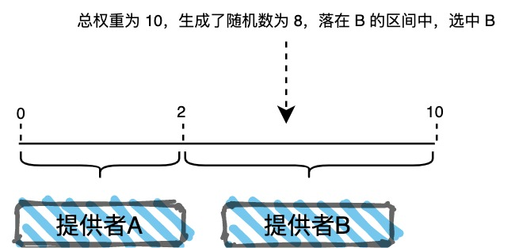
:::

- 源码如下所示

::: center
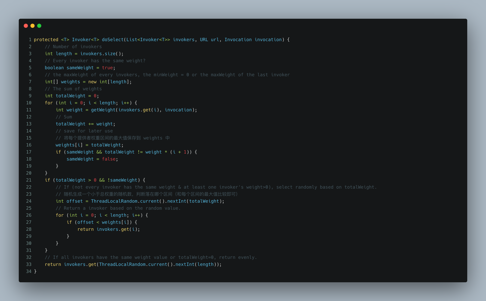
:::

- 因此，如果某个提供者所在的服务器性能比较好，可以通过提高其权重让负载均衡选中其的概率更高。

### 2. ShortedResponseTimeLoadBalance

- 最短响应时间策略，于 2.7.7 版本添加，对应提交记录为 [add new loadbalance strategy (apache#6064)](https://github.com/chickenlj/incubator-dubbo/commit/6d2ba7ec7b5a1cb7971143d4262d0a1bfc826d45)

- 该策略是基于响应时间来选择 invoker 的，这个响应时间是一个估计值，计算公式 = 平均成功响应时间 * 活跃连接数，这里的平均成功响应时间是通过 `org.apache.dubbo.rpc.RpcStatus` 类来获取的，`计算公式 = 成功请求总耗时 / 成功请求数`。

- 注意了，`RpcStatus` 中的对应统计字段都是在 `Consumer` 端在调用前通过某些 `Filter` 来设置的，所以如果一些 `Filter` 没有设置的话，可能会导致统计字段不准确，进而影响到负载均衡的结果。

### 3. LeastActiveLoadBalance

- 最小活跃数策略，需要配置 `ActiveFilter`，否则 `RpcStatus` 中的 `active` 字段不会更新，导致策略不起作用。

- `org.apache.dubbo.rpc.cluster.loadbalance.AbstractLoadBalance#getWeight` 方法用于获取 `invoker` 的权重，其中会根据对应 `invoker` 的运行时间、配置的预热时间、来判断是否需要重新计算权重，具体逻辑如下图所示
   - 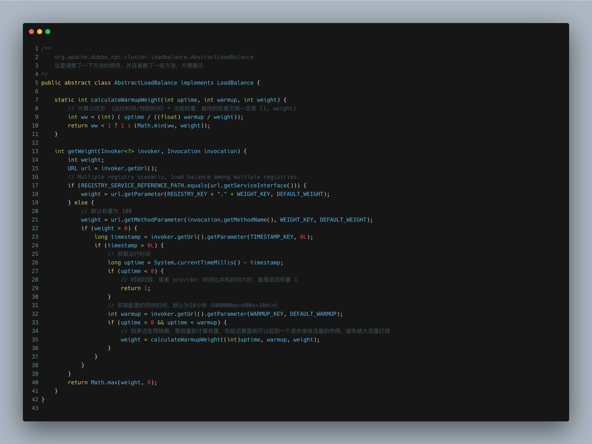

### 4. ConsistentHashLoadBalance

- 一致性哈希负载均衡策略，可以结合队列完成顺序请求的作用，把不同类的请求分发到不同的机子上。

::: note 看源码前的一些猜测
比如三个结点，那就生成三个hashcode，比如 a.hashcode = 10，b.hashCode = 100, c.hashCode = 500，那么每次请求过来的时候，根据参数计算一下 hashCode，如果落在 [10, 100]，那么由 b 结点处理，如果落在 [100, 500]，那么由c结点处理，如果落在 [500, Integer.MAX_VALUE] or [Integer.MIN_VALUE, 10]，那么就由 a 处理。

但是由于这样，出现了很明显的数据倾斜问题，那么对于每个结点，我就可以映射出多个虚拟结点来，说白了多计算出几个 hashCode ？ 然后依次形成区间，如果添加结点，那么就增加 hashCode，移除结点，那么就移除 hashCOde？
:::

- 和猜测的一样，使用 `TreeMap` 实现，对于每个 `invoker` 计算出多个 hashcode 放入 `TreeMap` 中，调用时根据参数进行 hash 计算，通过 `TreeMap.cellingEntry` 获取对应结点，如果为 null ，说明在最后一个区间，那么就直接取第一个结点即可。

::: center
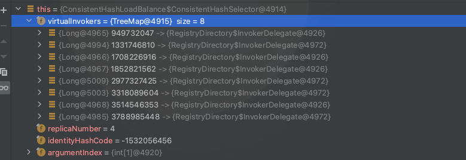

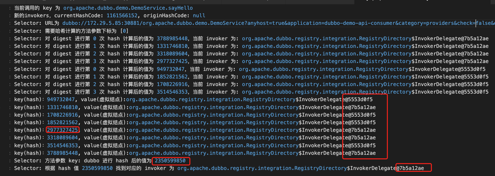


:::

### 5. RandomRobinLoadBalance

- 加权轮训，和加权随机不一样，例如权重比3:2:1，加权随机是大致接近这个比例，因为有随机性，而加权轮询则一定是3:2:1
   - 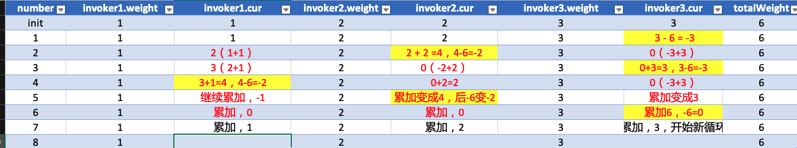
- 第一次，选中 30882(weight=3)
   - 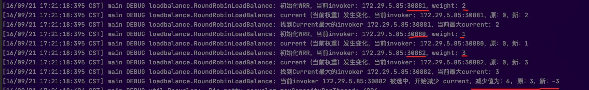
- 第二次，选中 30881（weight=2）
   - 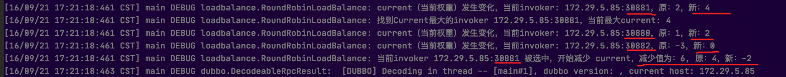
- 第三次，选中 30880（weight=1）
   - 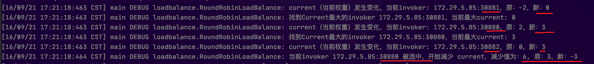
- 第四次，选中 30882
   - 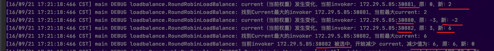
- 第五次，选中 30881
   - 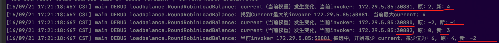
- 第六次，选中 30882，至此已完成 3:2:1 的比例
   - 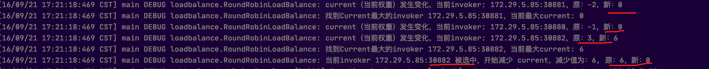

- 基础版的无权轮询
```java
package org.apache.dubbo.rpc.cluster.loadbalance;

import org.apache.dubbo.common.URL;
import org.apache.dubbo.common.utils.AtomicPositiveInteger;
import org.apache.dubbo.rpc.Invocation;
import org.apache.dubbo.rpc.Invoker;
import org.slf4j.Logger;
import org.slf4j.LoggerFactory;

import java.util.List;
import java.util.Map;
import java.util.concurrent.ConcurrentHashMap;

/**
 * 普通轮询负载均衡算法，基于方法级别
 *
 * @author YuKaiFan <yukf@pvc123.com>
 * @version 1.0
 * @date 2021/9/16
 */
public class MyRoundRobinLoadBalance extends AbstractLoadBalance {

    private static final Logger LOGGER = LoggerFactory.getLogger(MyRoundRobinLoadBalance.class);

    public static final String NAME = "my";

    /** 统计每个方法的调用次数, key: cn.ykf.demo.service.DemoService.test, value: 0 */
    private final Map<String, AtomicPositiveInteger> sequences = new ConcurrentHashMap<>();

    @Override
    protected <T> Invoker<T> doSelect(List<Invoker<T>> invokers, URL url, Invocation invocation) {
        if (LOGGER.isDebugEnabled()) {
            LOGGER.debug("开始进行轮询负载均衡，invokers.size(): {}", invokers.size());
        }

        // 拼装key
        String key = invokers.get(0).getUrl().getServiceInterface() + "." + invocation.getMethodName();
        if (LOGGER.isDebugEnabled()) {
            LOGGER.debug("当前 key 为：{}", key);
        }

        // 获取方法的计数器
        AtomicPositiveInteger counter = sequences.putIfAbsent(key, new AtomicPositiveInteger(0));
        if (counter == null) {
            if (LOGGER.isDebugEnabled()) {
                LOGGER.debug("首次访问 {}", key);
            }
            counter = sequences.get(key);
        }

        // 直接轮询取模就可以了，这里为了方便打印日志
        int current = counter.getAndIncrement();
        int index = current % invokers.size();
        if (LOGGER.isDebugEnabled()) {
            LOGGER.debug("第 {} 次访问方法，选中 invoker 下标为 {}", current, index);
        }

        return invokers.get(index);
    }

}
```

- 加权的轮询，基于invoker的轮询
```java
package org.apache.dubbo.rpc.cluster.loadbalance;

import org.apache.dubbo.common.URL;
import org.apache.dubbo.common.utils.AtomicPositiveInteger;
import org.apache.dubbo.rpc.Invocation;
import org.apache.dubbo.rpc.Invoker;
import org.slf4j.Logger;
import org.slf4j.LoggerFactory;

import java.util.List;
import java.util.Map;
import java.util.concurrent.ConcurrentHashMap;
import java.util.concurrent.ThreadLocalRandom;

/**
 * 加权轮询负载均衡算法，基于invoker级别
 *
 * @author YuKaiFan <yukf@pvc123.com>
 * @version 2.0
 * @date 2021/9/16
 */
public class MyRoundRobinLoadBalance extends AbstractLoadBalance {

    private static final Logger LOGGER = LoggerFactory.getLogger(MyRoundRobinLoadBalance.class);

    public static final String NAME = "my";

    /** 统计每个方法的调用次数, key: cn.ykf.demo.service.DemoService.test, value: 0 */
    private final Map<String, AtomicPositiveInteger> sequences = new ConcurrentHashMap<>();

    /** 每个invoker的当前权重 */
    private final Map<String, Integer> invokerWeight = new ConcurrentHashMap<>();

    @Override
    protected <T> Invoker<T> doSelect(List<Invoker<T>> invokers, URL url, Invocation invocation) {
        if (LOGGER.isDebugEnabled()) {
            LOGGER.debug("开始进行轮询负载均衡，invokers.size(): {}", invokers.size());
        }

        int totalWeight = 0;
        int maxWeight = 0;
        Invoker<T> selected = null;
        String selectedKey = null;

        for (Invoker<T> invoker : invokers) {
            // 拼装key
            String key = invoker.getUrl().getAddress();
            if (LOGGER.isDebugEnabled()) {
                LOGGER.debug("当前 key（invoker） 为：{}", key);
            }

            int weight = getWeight(invoker, invocation);
            totalWeight += weight;

            // 初始化每个 invoker 的当前权重
            Integer cur = invokerWeight.get(key);
            if (cur == null) {
                if (LOGGER.isDebugEnabled()) {
                    LOGGER.debug("首次访问 {}，将当前权重初始化为0", key);
                }
                invokerWeight.putIfAbsent(key, 0);
            }

            // 每次循环都需要增加当前权重
            Integer origin = invokerWeight.get(key);
            invokerWeight.put(key, origin + weight);
            cur = invokerWeight.get(key);
            if (LOGGER.isDebugEnabled()) {
                LOGGER.debug("当前 invoker {} 的真实权重为 {}，原当前权重为 {}，增加后当前权重为 {}，总权重为 {}", key, weight,origin, cur, totalWeight);
            }

            if (cur > maxWeight) {
                maxWeight = cur;
                selected = invoker;
                selectedKey = key;
                if (LOGGER.isDebugEnabled()) {
                    LOGGER.debug("当前 invoker {} 为最大权重，选中", key);
                }
            }

        }

        // 如果没有找到最大权重，那么就随机一个
        if (selected == null) {
            return invokers.get(ThreadLocalRandom.current().nextInt(invokers.size()));
        }

        // 减少选中invoker的当前权重
        invokerWeight.put(selectedKey, invokerWeight.get(selectedKey) - totalWeight);

        return selected;
    }

}
```

### 参考链接

- [dubbo负载均衡之RoundRobin](https://www.jianshu.com/p/a6ac80111b9f)
- [吐血输出：2万字长文带你细细盘点五种负载均衡策略。](https://mp.weixin.qq.com/s/q4zXseGtpfDY62Z3wGn1uA)
