## 1. 什么是远程过程调用

在讲述Dubbo的服务调用过程之前，让我们先来了解一下什么是远程过程调用。

远程过程调用即 `Remote Procedure Call`，简单来说就是跨进程调用，通过网络传输，使得A机器上的应用可以像调用本地的服务一样去调用B机器上的服务。

举个最简单的🌰，假设现在有一个电商系统，其中有着用户服务，优惠券服务，订单服务等服务模块，这些不同的服务并不是运行在同一个JVM中，而是分开运行在不同的JVM中。因此，当订单服务想要调用优惠券服务时，就不能像以前的单体应用一样，直接向对应服务发起本地调用，只能够通过网络来发起调用。

那么，一个最简单的远程过程调用是怎么样的呢？来看下面这张图。

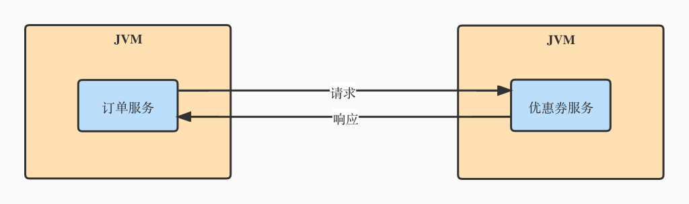

也就是说，一次最简单的RPC调用，无非就是调用方通过网络，将调用的参数传送到服务方，服务方收到调用请求后，根据参数完成本地调用，并且将结果通过网络传送回调用方。在这个过程中，像参数的封装，网络传输等细节会由RPC框架来完成，把上面的图片完善一下，一个完整的RPC调用的流程是这样的：

1. 客户端（Client）以本地调用的方式调用远程服务。

2. 客户端代理对象（Client Stub）将本次请求的相关信息（要调用的类名、方法名、方法参数等）封装成 `Request`，并且对其序列化，为网络通信做准备。

3. 客户端代理对象（Client Stub）找到服务端（Server）的地址，通过网络（Socket通信）将 `Request` 发送到服务端。

4. 服务端代理对象（Server Stub）接收到客户端（Client）的请求后，将二进制数据反序列化为 `Request`。

5. 服务端代理对象（Server Stub）根据调用信息向本地的方法发起调用。

6. 服务端代理对象（Server Stub）将调用后的结果封装到 `Response` 中，并且对其序列化，通过网络发送给客户端。

7. 客户端代理对象（Client Stub）收到响应后，将其反序列化为 `Response`，远程调用结束。

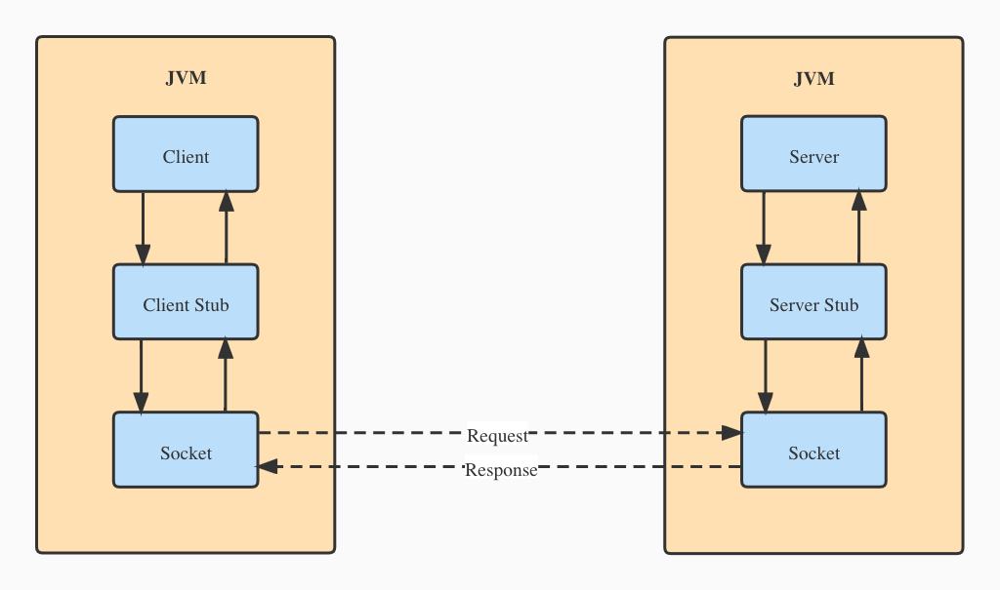

## 2. Dubbo 的远程调用过程

::: tip
本节内容基于 Dubbo 2.6.x 版本，并且使用官网提供的 Demo 对同步调用进行分析。
:::

在上一节内容中，我们已经对服务调用的过程有了一定的了解。实际上，Dubbo 在实现远程调用的时候，核心流程和上面的图片是完全一样的，只不过 Dubbo 在此基础上增加了一些额外的流程，例如集群容错、负载均衡、过滤器链等。本篇文章只分析核心的调用流程，其它的额外流程可以自行了解。

在讲解 Dubbo 的调用过程之前，我们先来了解一下 Dubbo 的一些核心概念。

-  `Invoker`：在 Dubbo 中作为实体域，也就是代表了要操作的对象模型，这有点像 Spring 中的 Bean，所有的操作都是围绕着这个实体域来进行。 
   - 代表了一个可执行体，可以向它发起 `invoke` 调用。它有可能是一个本地实现，也有可能是一个远程实现，也有可能是一个集群实现。

-  `Invocation`：在 Dubbo 中作为会话域，表示每次操作的瞬时状态，操作前创建，操作后销毁。 
   - 其实 `Invocation` 就是调用信息，也就是用于存放方法名、参数等信息。

-  `Protocol`：在 Dubbo 作为服务域，负责实体域和会话域的生命周期管理。 
   - 可以理解为 Spring 中的 BeanFactory，是产品的入口。

### 2.1 远程调用的开端 —— 动态代理

在了解以上基本概念后，我们开始来跟踪 Dubbo 的远程调用流程。在 RPC 框架中，想要实现远程调用，代理对象是不可或缺的，因为它可以帮我们屏蔽很多底层细节，使得我们对远程调用无感知。

如果用过 `JDK` 的动态代理或者是 `CGLIB` 的动态代理，那么应该都知道每个代理对象都会有对应的一个处理器，用于处理动态代理时的增强，例如 `JDK` 使用的 `InvacationHandler` 或者  `CGLIB` 的 `MethodInterceptor`。

在 Dubbo 中，默认是使用 `javasisst` 来实现动态代理的，它与 `JDK` 动态代理一样使用 `InvocationHandler` 来进行代理增强。

```java
package com.alibaba.dubbo.rpc.proxy;

import com.alibaba.dubbo.rpc.Invoker;
import com.alibaba.dubbo.rpc.RpcInvocation;

import java.lang.reflect.InvocationHandler;
import java.lang.reflect.Method;

public class InvokerInvocationHandler implements InvocationHandler {
    /** 一般是一个集群相关的 Invoker */
    private final Invoker<?> invoker;

    public InvokerInvocationHandler(Invoker<?> handler) {
        this.invoker = handler;
    }

    @Override
    public Object invoke(Object proxy, Method method, Object[] args) throws Throwable {
        String methodName = method.getName();
        Class<?>[] parameterTypes = method.getParameterTypes();
        if (method.getDeclaringClass() == Object.class) {
            return method.invoke(invoker, args);
        }
        if ("toString".equals(methodName) && parameterTypes.length == 0) {
            return invoker.toString();
        }
        if ("hashCode".equals(methodName) && parameterTypes.length == 0) {
            return invoker.hashCode();
        }
        if ("equals".equals(methodName) && parameterTypes.length == 1) {
            return invoker.equals(args[0]);
        }
        // 根据调用方法和调用参数生成调用信息 Invocation，并向后传递
        return invoker.invoke(new RpcInvocation(method, args)).recreate();
    }
}
```

下面分别是使用 `javasisst` 和使用 `JDK` 动态代理时对代理类进行反编译后的结果。

```java
/** javasisst */
public class proxy0 implements ClassGenerator.DC, DemoService {
    public static Method[] methods;
    private InvocationHandler handler;
  
    public proxy0() {
    }

    public proxy0(InvocationHandler invocationHandler) {
        this.handler = invocationHandler;
    }

    public String sayHello(String string) {
        // 封装参数
        Object[] objectArray = new Object[]{string};
        // 委托给 Handler 调用
        Object object = this.handler.invoke(this, methods[0], objectArray);
        return (String)object;
    }
}
```

```java
package com.sun.proxy;

import com.alibaba.dubbo.demo.DemoService;
import java.lang.reflect.InvocationHandler;
import java.lang.reflect.Method;
import java.lang.reflect.Proxy;
import java.lang.reflect.UndeclaredThrowableException;

/** jdk */
public final class $Proxy10 extends Proxy implements DemoService {
    private static Method m1;
    private static Method m3;
    private static Method m2;
    private static Method m0;

    static {
        try {
            // 反射获取需要增强的 Method
            m1 = Class.forName("java.lang.Object").getMethod("equals", Class.forName("java.lang.Object"));
            m3 = Class.forName("com.alibaba.dubbo.demo.DemoService").getMethod("sayHello", Class.forName("java.lang.String"));
            m2 = Class.forName("java.lang.Object").getMethod("toString", new Class[0]);
            m0 = Class.forName("java.lang.Object").getMethod("hashCode", new Class[0]);
            return;
        } catch (NoSuchMethodException noSuchMethodException) {
            throw new NoSuchMethodError(noSuchMethodException.getMessage());
        } catch (ClassNotFoundException classNotFoundException) {
            throw new NoClassDefFoundError(classNotFoundException.getMessage());
        }
    }

    public $Proxy10(InvocationHandler invocationHandler) {
        super(invocationHandler);
    }

    public final boolean equals(Object object) {
        try {
            return (Boolean)this.h.invoke(this, m1, new Object[]{object});
        }
        catch (Error | RuntimeException throwable) {
            throw throwable;
        }
        catch (Throwable throwable) {
            throw new UndeclaredThrowableException(throwable);
        }
    }

    public final String sayHello(String string) {
        try {
            // 封装参数，发起调用
            return (String)this.h.invoke(this, m3, new Object[]{string});
        }
        catch (Error | RuntimeException throwable) {
            throw throwable;
        }
        catch (Throwable throwable) {
            throw new UndeclaredThrowableException(throwable);
        }
    }

    public final String toString() {
        try {
            return (String)this.h.invoke(this, m2, null);
        }
        catch (Error | RuntimeException throwable) {
            throw throwable;
        }
        catch (Throwable throwable) {
            throw new UndeclaredThrowableException(throwable);
        }
    }

    public final int hashCode() {
        try {
            return (Integer)this.h.invoke(this, m0, null);
        }
        catch (Error | RuntimeException throwable) {
            throw throwable;
        }
        catch (Throwable throwable) {
            throw new UndeclaredThrowableException(throwable);
        }
    }
}
```

从上面可以看出，`InvacationHandler` 要做的事无非就是根据本次调用的方法名和方法参数，将其封装成调用信息 `Invacation`，然后将其传递给持有的 `Invoker` 对象。

从这里开始，才算是真正进入到了 Dubbo 的核心模型中。

### 2.2 客户端的调用链路

在了解 `Invoker` 的链路之前，我们需要先看一下 Dubbo 的整体设计，下图是来自于 Dubbo 官网的一张框架设计图，很好地展示了整个框架的结构。


为了便于理解，我把上图中的 `Proxy` 层到 `Protocol` 层（省略 `Monitor` 层）进行了一个抽象。如下图所示， Dubbo 的 `Proxy` 代理层的直接与下层的 `Cluster` 集群层进行交互。`Cluster` 这一层的作用就是将多个 `Invoker` 伪装成一个 `ClusterInvoker` 后暴露给上层使用，由该 `ClusterInvoker` 来负责容错的相关逻辑，例如快速失败，失败重试等等。对于上层的 `Proxy` 来说，这一层的容错逻辑是透明的。

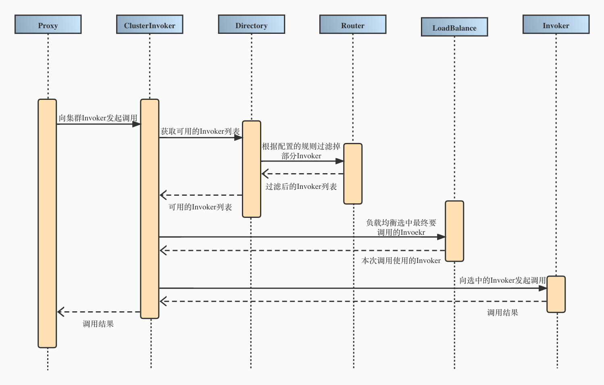

因此，当 `Proxy` 层的 `InvocationHandler` 将调用请求委托给持有的 `Invoker` 时，其实就是向下传递给对应的 `ClusterInvoker`，并且经过获取可用 `Invoker`，根据路由规则过滤 `Invoker`，以及负载均衡选中要调用的 `Invoker` 等一系列操作后，就会得到一个具体协议的 `Invoker`。这个具体的 `Invoker` 可能是一个远程实现，例如默认的 Dubbo 协议对应的 `DubboInvoker`，也有可能是一个本地实现，例如 Injvm 协议对应的 `InjvmInvoker` 等。

::: tip
关于集群相关的 `Invoker`，如果有兴趣的话可以看一下用于服务降级的 `MockClusterInvoker`，集群策略抽象父类 `AbstractClusterInvoker` 以及默认的也是最常用的失败重试集群策略 `FailoverClusterInvoker`，实际上默认情况下的集群调用链路就是逐个经过这三个类的。 

顺带提一句，在获取到具体的协议 `Invoker` 之前会经过一个过滤器链，对于每一个过滤器对于本次请求都会做一些处理，比如用于统计的 `MonitorFilter`，用于处理当前上下文信息的 `ConsumerContextFilter` 等等。过滤器这一部分给用户提供了很大的扩展空间，有兴趣的话可以自行了解。
:::

拿到具体的 `Invoker` 之后，此时所处的位置为架构图中的 `Protocol` 层，这时候就可以通过下层的网络层来完成远程过程调用了，先来看一下 `DubboInvoker` 的源码。

```java
public class DubboInvoker<T> extends AbstractInvoker<T> {
    /** 用于网络通信 */
    private final ExchangeClient[] clients;

    @Override
    protected Result doInvoke(final Invocation invocation) throws Throwable {
        // 省略了一些调用信息的处理，例如设置当前客户端Dubbo版本号等
        ExchangeClient currentClient;
        if (clients.length == 1) {
            currentClient = clients[0];
        } else {
            currentClient = clients[index.getAndIncrement() % clients.length];
        }
        try {
            // 根据 URL 中的某些 key 判断本次调用是否为异步调用，或者为单次调用
            boolean isAsync = RpcUtils.isAsync(getUrl(), invocation);
            boolean isOneway = RpcUtils.isOneway(getUrl(), invocation);
            int timeout = getUrl().getMethodParameter(methodName, Constants.TIMEOUT_KEY, Constants.DEFAULT_TIMEOUT);
            if (isOneway) {
                boolean isSent = getUrl().getMethodParameter(methodName, Constants.SENT_KEY, false);
                // 单次调用，只需要将请求发送出去，不关心返回结果
                currentClient.send(inv, isSent);
                RpcContext.getContext().setFuture(null);
                return new RpcResult();
            } else if (isAsync) {
                // 异步调用，将请求发送出去，并将本次请求对应的 DefaultFuture 放入上下文中
                ResponseFuture future = currentClient.request(inv, timeout);
                RpcContext.getContext().setFuture(new FutureAdapter<Object>(future));
                return new RpcResult();
            } else {
                RpcContext.getContext().setFuture(null);
                // 同步调用，调用 DefaultFuture.get() 等待返回结果，异步转同步
                return (Result) currentClient.request(inv, timeout).get();
            }
        } catch (TimeoutException e) {
            throw new RpcException(RpcException.TIMEOUT_EXCEPTION, "Invoke remote method timeout. method: " + invocation.getMethodName() + ", provider: " + getUrl() + ", cause: " + e.getMessage(), e);
        } catch (RemotingException e) {
            throw new RpcException(RpcException.NETWORK_EXCEPTION, "Failed to invoke remote method: " + invocation.getMethodName() + ", provider: " + getUrl() + ", cause: " + e.getMessage(), e);
        }
    }
}
```

可以看到，Dubbo 对于调用方式做了一些区分，分别为同步调用，异步调用以及单次调用。有一点要明确的是，不管是同步调用还是异步调用，这都是站在用户的角度来看的，但是在网络这一层面的话，所有的交互都是异步的，网络框架只负责将数据发送出去，或者将收到的数据向上传递，网络框架并不知道本次发送出去的二进制数据和收到的二进制的数据是否是一一对应的。

因此，当用户选择同步调用的时候，为了将底层的异步通信转化为同步操作，这里 Dubbo 需要调用某个阻塞操作，使用户线程阻塞在这里，直到本次调用的结果返回。

### 2.3 远程调用的基石 —— 网络层

在上一小节的  `DubboInvoker` 当中，我们可以看到远程调用的请求是通过一个 `ExchangeClient` 的类发送出去的，这个 `ExchangeClient` 类处于 Dubbo 框架的 Remoting 模块中的 `Exchange` 层，也就是远程通信模块中的信息交换层。

从前面出现过的架构图中可以看到，远程通信模块共分为三层，从上到下分别是 `Exchange` 信息交换层，`Transport` 网络传输层以及 `Serialize` 序列化层，每一层都有其特定的作用。

从最底层的 `Serialize` 层说起，这一层的作用就是负责对象的序列化/反序列化，它对多种序列化方式进行了抽象，如 `JDK` 序列化，`Hessian` 序列化，`JSON` 序列化等。

往上则是 `Transport` 层，这一层负责的单向的消息传输，强调的是一种 `Message` 的语义，不体现交互的概念。同时这一层也对各种 NIO 框架进行了抽象，例如 `Netty`，`Mina`等等。

再往上就是 `Exhange` 层，和 `Transport` 层不同，这一层负责的是请求-响应的交互，强调的一种 `Request`-`Reponse` 的语义，也正是由于请求响应的存在，才会有 `Client` 和 `Server` 的区分。

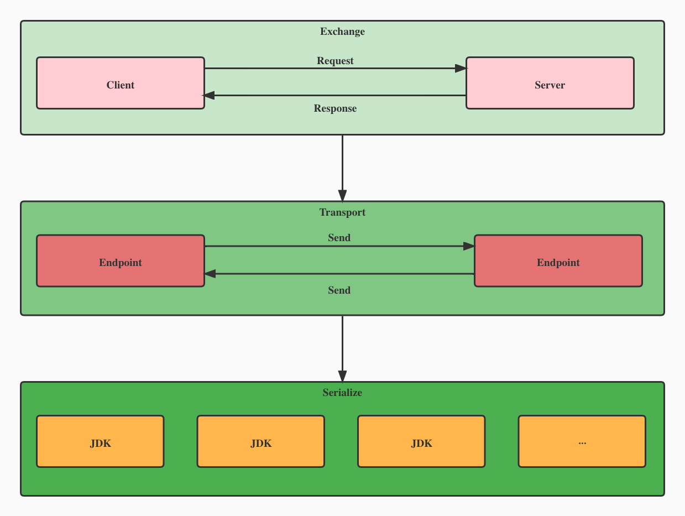

了解完 Remoting 模块的分层结构后，我们再来看一下该模块中的核心概念。

Dubbo 在这个模块中抽取出了一个端点（Endpoint）的概念，通过一个 IP 和 一个 Port，就可以唯一确定一个端点。在这两个端点之间，我们可以建立 TCP 连接，而这个连接被 Dubbo 抽象成了通道（Channel），通道处理器（ChannelHandler）则负责对通道进行处理，例如处理通道的连接建立事件、连接断开事件，处理读取到的数据、发送的数据以及捕获到的异常等。同时，为了在语义上对端点进行区分，Dubbo 将发起请求的端点抽象为客户端(Client)，而发送响应的端点则抽象成服务端(Server)。

由于不同的 NIO 框架对外接口和使用方式不一样，所以为了避免上层接口直接依赖具体的 NIO 库，Dubbo 在 `Client` 和 `Server` 之上又抽象出了一个 `Transporter` 接口，该接口用于获取 `Client` 和 `Server`，后续如果需要更换使用的 NIO 库，那么只需要替换相关实现类即可。

::: tip
Dubbo 将负责数据编解码功能的处理器抽象成了 `Codec` 接口，有兴趣的话可以自行了解。
:::

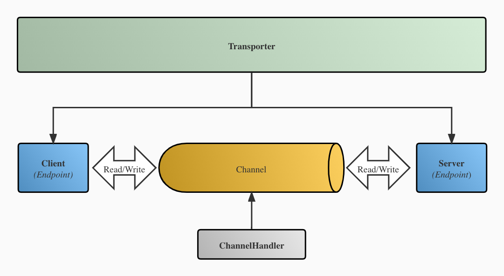

`Endpoint` 主要的作用就是发送数据，因此有 `send()` 方法；`Channel`继承了 `Endpoint`，在发送数据的基础上，增加了 `K/V` 属性的附加功能。对于客户端来说，一个 `Client` 只会关联着一个 `Channel`，因此直接继承 `Channel` 使其也具备发送数据的功能即可，而 `Server` 可以接受多个 `Client` 建立的 `Channel` 连接，所以 Dubbo 没有让其继承 `Channel`，而是选择让其直接继承 `Endpoint`，并且提供了 `getChannels()` 方法用于获取关联的连接。

同时，为了体现了请求/响应的交互模式，在 `Channel`、`Server` 以及 `Client` 的基础上进一步抽象出 `ExchangeChannel`、`ExchangeServer` 以及 `ExchangeClient` 接口，并为 `ExchangeChannel` 接口添加 `request()` 方法，具体类图如下。

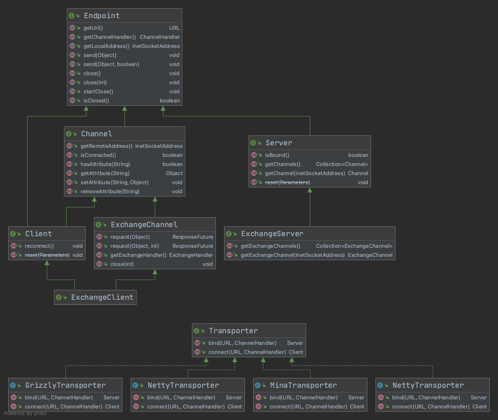

了解完网络层的相关概念后，让我们看回 `DubboInvoker`，当同步调用时，`DubboInvoker` 会通过持有的 `ExchangeClient` 来发起请求。实际上，这个调用最后会被 `HeaderExchangeChannel` 类所接收，这是一个实现了 `ExchangeChannel` 的类，因此也具备了请求的功能。

```java
final class HeaderExchangeChannel implements ExchangeChannel {
    /** 实际上就是一个用于发送消息的Client，例如 NettyClient */
    private final Channel channel;

    @Override
    public void send(Object message, boolean sent) throws RemotingException {
        // 省略校验...
        if (message instanceof Request
                || message instanceof Response
                || message instanceof String) {
            // 调用send将数据发送出去
            channel.send(message, sent);
        } else {
            Request request = new Request();
            request.setVersion(Version.getProtocolVersion());
            request.setTwoWay(false);
            request.setData(message);
            channel.send(request, sent);
        }
    }

    @Override
    public ResponseFuture request(Object request, int timeout) throws RemotingException {
        // 省略校验...
        // 将请求数据（调用信息Invocation）封装为 Request 对象
        Request req = new Request();
        req.setVersion(Version.getProtocolVersion());
        req.setTwoWay(true);
        req.setData(request);
        // 创建 DefaultFuture 用于接收响应
        DefaultFuture future = new DefaultFuture(channel, req, timeout);
        try {
            // 调用send将数据发送出去
            channel.send(req);
        } catch (RemotingException e) {
            future.cancel();
            throw e;
        }
        return future;
    }
}
```

可以看到，其实 `request()` 方法只不过是将数据封装成 `Request` 对象，构造一个请求的语义，最终还是通过  `send()` 方法将数据发送出去。下面是一张关于客户端发送请求的调用链路图。

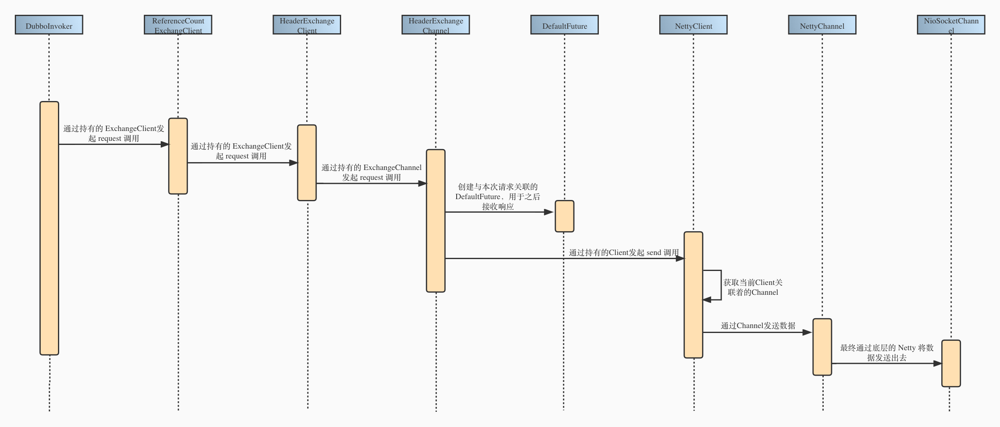

这里值得注意的是 `DefaultFuture` 对象的创建。`DefaultFuture` 类是 Dubbo 参照 Java 中的 `Future` 类所设计的，这意味着它可以用于异步操作。每个 `Request` 对象都有一个ID，当创建 `DefaultFuture` 时，会将请求ID和创建的 `DefaultFutrue` 映射给保存起来，同时设置超时时间。

保存映射的目的是因为在异步情况下，请求和响应并不是一一对应的。为了使得后面接收到的响应可以正确被处理，Dubbo 会在响应中带上对应的请求ID，当接收到响应后，根据其中的请求ID就可以找到对应的 `DefaultFuture`，并将响应结果设置到 `DefaultFuture`，使得阻塞在 `get()` 操作的用户线程可以及时返回。

```java
public DefaultFuture(Channel channel, Request request, int timeout) {
    this.channel = channel;
    this.request = request;
    // Future 的 ID 就是 Request 的ID
    this.id = request.getId();
    // 设置超时时间
    this.timeout = timeout > 0 ? timeout : channel.getUrl().getPositiveParameter(Constants.TIMEOUT_KEY, Constants.DEFAULT_TIMEOUT);
    // 保存当前RequestId和Future的映射
    FUTURES.put(id, this);
    CHANNELS.put(id, channel);
}
```

::: center
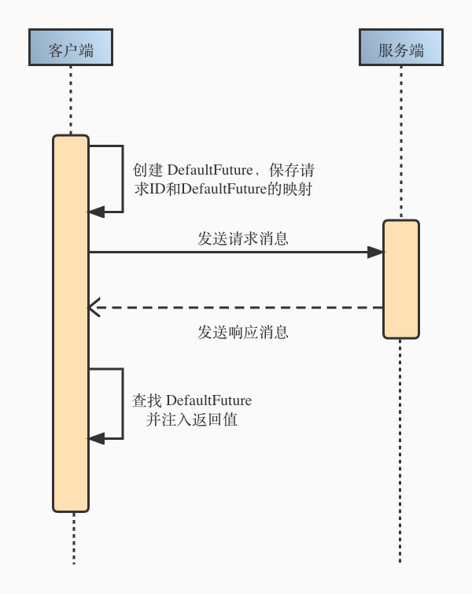
:::

当 `ExchangeChannel` 调用 `send()` 后，数据就会通过底层的 NIO 框架发送出去，不过在将数据通过网络传输之前，还有最后一步需要做的，那就是序列化和编码。

::: tip
有一点需要注意，在调用 `send()` 方法之前，所有的逻辑都是用户线程在处理的，而编码工作则是由 Netty 的 I/O 线程处理，有兴趣的话可以了解一下 Netty 的线程模型。
:::

### 2.4 协议和编码

上文出现过好几次协议（Protocol）和编码，那么到底什么是协议，什么又是编码呢?

通俗一点讲，协议其实就是一套约定好的通信规则。打个比方，张三和李四要进行交流，那么他们之间在交流之前就需要先约定好如何交流，比如双方约定，当听到“Hello World”的时候，就代表对方要开始讲话了。此时，张三和李四之间的这种约定就是他们的通信协议。

而对于编码的话，其实就是根据约定好的协议，将数据组装成协议规定的格式。当张三想和李四说“早上好”的时候，那么张三只需要在“早上好”之前加上约定好的“Hello World”，也就是最终的消息为“Hello World早上好”。李四一听到“Hello World”，就知道随后的内容是张三想说的。通过这种形式，张三和李四之间就可以完成正常的交流了。

具体到实际的RPC通信中，所谓的 Dubbo 协议，RMI 协议，HTTP 协议等等，归根到底就是对应的通信规则不一样，但最终的作用都是一样的，就是让通信数据按对应的规则给组装起来，仅此而已。

这里借用一张官网的图，展示了默认的 Dubbo 协议数据包格式。

Dubbo 数据包分为消息头和消息体。消息头为定长格式，共 16 字节，用于存储一些元信息，例如消息的起始标识 `Magic Number`，数据包的类型，使用的序列化方式ID，消息体长度等。消息体则为变长格式，具体长度存储在消息头中，这部分是用于存储具体的调用信息或调用结果，也就是 `Invocation` 序列化后的字节序列或远程调用返回的对象的字节序列，消息体这部分的数据是由序列化/反序列化来处理的。


之前提到过，Dubbo 将用于编解码数据的通道处理器抽象为了 `Codec` 接口，所以在消息发送出去之前，Dubbo 会0调用该接口的 `encode()` 方法进行编码。其中，对于消息体，也就是本次调用的调用信息 `Invacation`，会通过 `Serialization` 接口来进行序列化。

::: tip
Dubbo 在启动客户端和服务端的时候，会通过适配器模式，将 `Codec` 相关的编解码器与 Netty 进行适配，将其添加到 Netty 的 pipeline 中，参见 `NettyCodecAdapter`、`NettyClient` 和 `NettyServer`。
:::


下面是相关的编码逻辑，对照上图食用更佳。

```java
public class ExchangeCodec extends TelnetCodec {
    /** header length. 消息头长度为16个字节*/
    protected static final int HEADER_LENGTH = 16;
    /** magic header. 魔数头部，2个字节，todo 记得是用来表示所使用的协议的 */
    protected static final short MAGIC = (short) 0xdabb;
    /** 魔数高位字节*/
    protected static final byte MAGIC_HIGH = Bytes.short2bytes(MAGIC)[0];
    /** 魔数低位字节 */
    protected static final byte MAGIC_LOW = Bytes.short2bytes(MAGIC)[1];
    /** message flag. 消息类型，第16位如果为1代表是request，为0代表是response */
    protected static final byte FLAG_REQUEST = (byte) 0x80;
    /** 调用方式，仅在第16位为1的情况下有效 0 - 单向调用，1 - 双向调用 */
    protected static final byte FLAG_TWOWAY = (byte) 0x40;
    /** 事件标志，0 - request/response数据包，1 - 心跳包 */
    protected static final byte FLAG_EVENT = (byte) 0x20;
    /** 5bit的序列化编号掩码，应该是为了与运算的，第19-23位代表序列化方式 */
    protected static final int SERIALIZATION_MASK = 0x1f;
    private static final Logger logger = LoggerFactory.getLogger(ExchangeCodec.class);

    @Override
    public void encode(Channel channel, ChannelBuffer buffer, Object msg) throws IOException {
        if (msg instanceof Request) {
            // request 编码
            encodeRequest(channel, buffer, (Request) msg);
        } else if (msg instanceof Response) {
            // response 编码
            encodeResponse(channel, buffer, (Response) msg);
        } else {
            super.encode(channel, buffer, msg);
        }
    }

    protected void encodeRequest(Channel channel, ChannelBuffer buffer, Request req) throws IOException {
        // 获取序列化方式
        Serialization serialization = getSerialization(channel, req);
        // 消息头
        byte[] header = new byte[HEADER_LENGTH];
        // 设置魔数，前两个字节为魔数，0xdabb
        Bytes.short2bytes(MAGIC, header);

        // 设置消息类型和序列化ID。第三个字节包含，消息类型（1bit），通信方式（1bit），事件标志（1bit）以及序列化id（5bit）
        header[2] = (byte) (FLAG_REQUEST | serialization.getContentTypeId());

        if (req.isTwoWay()) {
            header[2] |= FLAG_TWOWAY;
        }
        if (req.isEvent()) {
            header[2] |= FLAG_EVENT;
        }

        // 设置请求id，从第5个字节开始，到第12个字节，共8个字节。这里跳过第4个字节是因为response包才有，代表响应状态
        Bytes.long2bytes(req.getId(), header, 4);

        // 获取当前buffer的写入位置
        int savedWriteIndex = buffer.writerIndex();
        // 更新写入位置，为消息头预留16个字节的空间
        buffer.writerIndex(savedWriteIndex + HEADER_LENGTH);
        ChannelBufferOutputStream bos = new ChannelBufferOutputStream(buffer);

        if (req.isHeartbeat()) {
            // heartbeat request data is always null
            bos.write(CodecSupport.getNullBytesOf(serialization));
        } else {
            // 创建序列化器，例如 Hessian2ObjectOutput
            ObjectOutput out = serialization.serialize(channel.getUrl(), bos);
            if (req.isEvent()) {
                encodeEventData(channel, out, req.getData());
            } else {
                // 序列化请求数据（也就是请求体，序列化的是  Request 中的 data 字段，也就是 RpcInvocation）
                // 运行时是调用子类 DubboCodec 的 encodeRequestData 方法
                encodeRequestData(channel, out, req.getData(), req.getVersion());
            }
            out.flushBuffer();
            if (out instanceof Cleanable) {
                ((Cleanable) out).cleanup();
            }
        }

        bos.flush();
        bos.close();
        // 写入的字节数，也就是请求体长度
        int len = bos.writtenBytes();
        // 判断消息体是否过长，例如传输excel时就有可能超出大小
        checkPayload(channel, len);
        // 从第13个字节开始，写入消息体长度，共4个字节，也就是13.14.15.16
        Bytes.int2bytes(len, header, 12);

        // 将buffer指针移动到原本的位置，并且将消息头写入
        buffer.writerIndex(savedWriteIndex);
        // 写入消息头
        buffer.writeBytes(header);
        // 最终的buffer指针应该为原本的下标+消息头长度+消息体长度
        buffer.writerIndex(savedWriteIndex + HEADER_LENGTH + len);
    }
}

public class DubboCodec extends ExchangeCodec {
    @Override
    protected void encodeRequestData(Channel channel, ObjectOutput out, Object data, String version) throws IOException {
        /* 自己编写一个最简单的RPC框架，要做的也就是这个了，按约定序列化，然后provider按约定反序列化 */
        RpcInvocation inv = (RpcInvocation) data;

        out.writeUTF(version);
        String serviceName = inv.getAttachment(INTERFACE_KEY);
        if (serviceName == null) {
            serviceName = inv.getAttachment(PATH_KEY);
        }
        // 接口名
        out.writeUTF(serviceName);
        out.writeUTF(inv.getAttachment(VERSION_KEY));

        // 调用的方法名
        out.writeUTF(inv.getMethodName());
        // 参数类型
        out.writeUTF(inv.getParameterTypesDesc());
        Object[] args = inv.getArguments();
        if (args != null) {
            for (int i = 0; i < args.length; i++) {
                // 实际参数
                out.writeObject(encodeInvocationArgument(channel, inv, i));
            }
        }
        // 序列化attachments
        out.writeAttachments(inv.getObjectAttachments());
    }
}
```

编码完成之后，数据就会被 NIO 框架所发出，通过网络到达服务端。

### 2.5 服务端的调用链路

当服务端接收到数据的时候，因为接收到的都是字节序列，所以第一步应该是对其解码，这一步最终会交给 `Codec` 接口的 `decode` 方法处理。解码的时候会先解析得到消息头，然后再根据消息头中的元信息，例如消息头长度，消息类型，将消息体反序列化为 `DecodeableRpcInvocation` 对象（也是调用信息）。

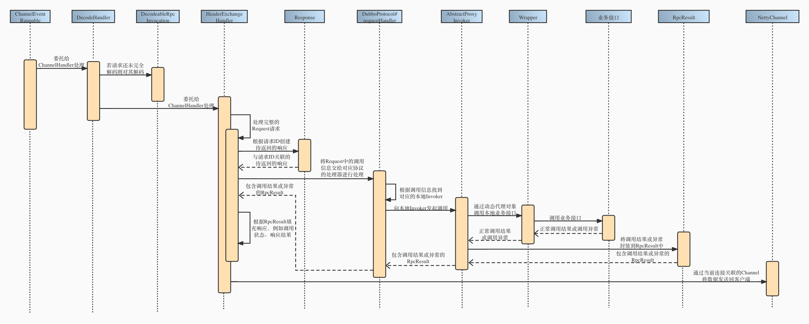

> 此时的线程为 Netty 的 I/O 线程，因此不一定会在当前线程解码，所以有可能会得到部分解码的 Request 对象，具体原因见下文。

```java
public class ExchangeCodec extends TelnetCodec {
    @Override
    public Object decode(Channel channel, ChannelBuffer buffer) throws IOException {
        int readable = buffer.readableBytes();
        // 消息头数组
        byte[] header = new byte[Math.min(readable, HEADER_LENGTH)];
        // 读取消息头，假如 readable = 20，那么就只读16个字节，剩下的是消息体
        buffer.readBytes(header);
        return decode(channel, buffer, readable, header);
    }

    @Override
    protected Object decode(Channel channel, ChannelBuffer buffer, int readable, byte[] header) throws IOException {
        // 检查魔数
        if (readable > 0 && header[0] != MAGIC_HIGH
                || readable > 1 && header[1] != MAGIC_LOW) {
            // 魔数不相等
            int length = header.length;
            if (header.length < readable) {
                header = Bytes.copyOf(header, readable);
                buffer.readBytes(header, length, readable - length);
            }
            for (int i = 1; i < header.length - 1; i++) {
                if (header[i] == MAGIC_HIGH && header[i + 1] == MAGIC_LOW) {
                    buffer.readerIndex(buffer.readerIndex() - header.length + i);
                    header = Bytes.copyOf(header, i);
                    break;
                }
            }
            // 通过 telnet 命令行发送的数据包不包含消息头，需要使用 TelnetCodec 来解码
            return super.decode(channel, buffer, readable, header);
        }
        // check length.
        if (readable < HEADER_LENGTH) {
            // 可读的数据小于消息头长度，需要更多数据
            return DecodeResult.NEED_MORE_INPUT;
        }

        // 获取消息体长度，校验长度是否超过限制
        int len = Bytes.bytes2int(header, 12);

        // When receiving response, how to exceed the length, then directly construct a response to the client.
        // see more detail from https://github.com/apache/dubbo/issues/7021.
        Object obj = finishRespWhenOverPayload(channel, len, header);
        if (null != obj) {
            return obj;
        }

        checkPayload(channel, len);

        // 消息总长度
        int tt = len + HEADER_LENGTH;
        if (readable < tt) {
            // 可读字节数小于实际所需要的字节数
            return DecodeResult.NEED_MORE_INPUT;
        }

        ChannelBufferInputStream is = new ChannelBufferInputStream(buffer, len);

        try {
            // 反序列化消息体
            return decodeBody(channel, is, header);
        } finally {
            if (is.available() > 0) {
                try {
                    if (logger.isWarnEnabled()) {
                        logger.warn("Skip input stream " + is.available());
                    }
                    StreamUtils.skipUnusedStream(is);
                } catch (IOException e) {
                    logger.warn(e.getMessage(), e);
                }
            }
        }
    }
}

public class DubboCodec extends ExchangeCodec {
    @Override
    protected Object decodeBody(Channel channel, InputStream is, byte[] header) throws IOException {
        // 获取第三个字节，和掩码进行与运算，得到序列化编号
        byte flag = header[2], proto = (byte) (flag & SERIALIZATION_MASK);
        // 从第五个字节开始读取请求ID
        long id = Bytes.bytes2long(header, 4);
        if ((flag & FLAG_REQUEST) == 0) {
            // 解码响应, 暂时省略...
        } else {
            // 服务端解码请求
            Request req = new Request(id);
            req.setVersion(Version.getProtocolVersion());
            // 是否为双向调用
            req.setTwoWay((flag & FLAG_TWOWAY) != 0);
            if ((flag & FLAG_EVENT) != 0) {
                // 是否为心跳事件
                req.setEvent(true);
            }
            try {
                Object data;
                if (req.isEvent()) {
                    // 解码事件，省略...
                } else {
                    // 普通请求解码
                    DecodeableRpcInvocation inv;
                    if (channel.getUrl().getParameter(DECODE_IN_IO_THREAD_KEY, DEFAULT_DECODE_IN_IO_THREAD)) {
                        // 在I/O线程上进行解码，也就是当前线程，2.6 默认true，2.7 之后默认为false
                        inv = new DecodeableRpcInvocation(channel, req, is, proto);
                        inv.decode();
                    } else {
                        // 仅创建DecodeableRpcInvocation对象，待派发到业务线程进行解码（DecodeHandler）
                        inv = new DecodeableRpcInvocation(channel, req,
                                new UnsafeByteArrayInputStream(readMessageData(is)), proto);
                    }
                    data = inv;
                }
                req.setData(data);
            } catch (Throwable t) {
                if (log.isWarnEnabled()) {
                    log.warn("Decode request failed: " + t.getMessage(), t);
                }
                // 解码失败的话将异常设置到data中
                req.setBroken(true);
                req.setData(t);
            }

            return req;
        }
    }
```

值得注意的是，在 2.6.x 版本中，默认情况下对于请求的解码会在 I/O 线程中执行，而 2.7.x 之后的版本则是交给业务线程执行。

这里的 I/O 线程指的是底层通信框架中接收请求的线程（其实就是 Netty 中的 Worker 线程），业务线程则是 Dubbo 内部用于处理请求/响应的线程池。如果某个事件可能比较耗时，不能在 I/O 线程上执行，那么就需要通过线程派发器将线程派发到线程池中去执行。

再次借用官网的一张图，当服务端接收到请求时，会根据不同的线程派发策略，将请求派发到线程池中执行。线程派发器 `Dispatcher` 本身并不具备线程派发的能力，它只是用于创建具有线程派发能力的 `ChannelHandler`。


Dubbo 拥有 5 种线程派发策略，默认使用的策略为 `all`，见下表。

| **策略** | **用途** |
| --- | --- |
| all | 所有消息都派发到线程池，包括请求，响应，连接事件，断开事件等 |
| direct | 所有消息都不派发到线程池，全部在 IO 线程上直接执行 |
| message | 只有请求和响应消息派发到线程池，其它消息均在 IO 线程上执行 |
| execution | 只有请求消息派发到线程池，不含响应。其它消息均在 IO 线程上执行 |
| Connection | 在 IO 线程上，将连接断开事件放入队列，有序逐个执行，其它消息派发到线程池 |


经过 `DubboCodec` 解码器处理过的数据会被 Netty 传递给下一个入站处理器，最终根据配置的线程派发策略来到对应的 `ChannelHandler`，例如默认的 `AllChannelHandler`。

```java
public class AllChannelHandler extends WrappedChannelHandler {
    // 省略连接事件、连接断开事件、异常捕获事件处理，都是一样直接构造 ChannelEventRunnable 后提交到业务线程池中处理
  
    @Override
    public void received(Channel channel, Object message) throws RemotingException {
        // message 就是含有 DecodeableRpcInvocation 的 Request 对象
        ExecutorService cexecutor = getExecutorService();
        try {
            // 将request/response的处理放到线程池中，由线程池执行接下来的调用逻辑
            cexecutor.execute(new ChannelEventRunnable(channel, handler, ChannelState.RECEIVED, message));
        } catch (Throwable t) {
            // 业务线程池已满，发送对应响应给客户端
            if(message instanceof Request && t instanceof RejectedExecutionException){
              Request request = (Request)message;
              if(request.isTwoWay()){
                String msg = "Server side(" + url.getIp() + "," + url.getPort() + ") threadpool is exhausted ,detail msg:" + t.getMessage();
                Response response = new Response(request.getId(), request.getVersion());
                response.setStatus(Response.SERVER_THREADPOOL_EXHAUSTED_ERROR);
                response.setErrorMessage(msg);
                channel.send(response);
                return;
              }
        	}
            throw new ExecutionException(message, channel, getClass() + " error when process received event .", t);
        }
    }
```

可以看到，对于每种事件，`AllChannelHandler` 只是创建了一个 `ChannelEventRunnable` 的 `Runnable` 对象并提交到业务线程池中去执行，`ChannelEventRunnable` 其实只是一个中转站，它是为了避免在 I/O 线程中执行具体的操作，最终真正的操作它会委托给持有的 `ChannelHandler` 去处理。

```java
public class ChannelEventRunnable implements Runnable {
    private static final Logger logger = LoggerFactory.getLogger(ChannelEventRunnable.class);

    private final ChannelHandler handler;
    /** 连接事件/断开连接事件/reqeust/response */
    private final Object message;

    @Override
    public void run() {
        // 频率高，提前判断，骚操作
        if (state == ChannelState.RECEIVED) {
            try {
                // 委托给 ChannelHandler 去执行
                handler.received(channel, message);
            } catch (Exception e) {
                logger.warn("ChannelEventRunnable handle " + state + " operation error, channel is " + channel
                        + ", message is " + message, e);
            }
        } else {
           // 其它事件一样调用 ChannelHandler 的对应方法
        }

    }
```

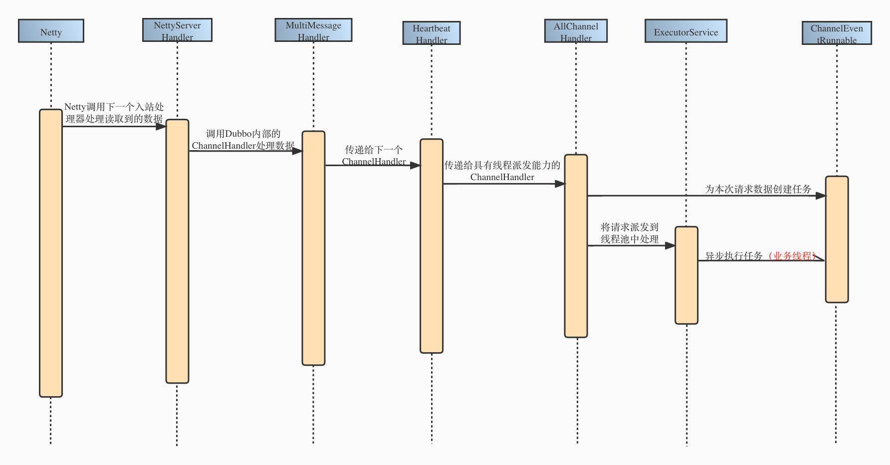

上面说过，解码操作也有可能在业务线程中执行，因为 `ChannelEventRunnable` 中直接持有的 `ChannelHandler` 就是一个用于解码的 `DecodeHandler`。

如果需要解码，那么这个通道处理器会调用在 I/O 线程中创建的 `DecodeableRpcInvocation` 对象的 `decode` 方法，该方法会从字节序列中反序列化得到本次调用的类名，方法名，参数信息等。

解码完成后，`DecodeHandler` 会将 `message`，也就是解码完成的 `Request` 对象继续传递到下一个 `ChannelHandler`，也就是 `HeaderExchangeHandler`。

```java
public class DecodeHandler extends AbstractChannelHandlerDelegate {

    @Override
    public void received(Channel channel, Object message) throws RemotingException {
        if (message instanceof Decodeable) {
            decode(message);
        }

        if (message instanceof Request) {
            // 解码 DecodeableRpcInvocation（也就是data的内容）
            decode(((Request) message).getData());
        }

        if (message instanceof Response) {
            decode(((Response) message).getResult());
        }

        // 下一个handler为 HeaderExchangeHandler
        handler.received(channel, message);
    }
  
    private void decode(Object message) {
        if (message instanceof Decodeable) {
            try {
                // 调用请求或响应的 decode 进行解码
                ((Decodeable) message).decode();
                if (log.isDebugEnabled()) {
                    log.debug("Decode decodeable message " + message.getClass().getName());
                }
            } catch (Throwable e) {
                if (log.isWarnEnabled()) {
                    log.warn("Call Decodeable.decode failed: " + e.getMessage(), e);
                }
            } // ~ end of catch
        } // ~ end of if
    } // ~ end of method decode  
}
```

到这里其实已经可以体会到 Dubbo 抽取出 `ChannelHandler` 的好处了，可以避免和特定 NIO 库耦合，同时使用装饰者模式一层层地处理请求，最终对 NIO 库只暴露出一个特定的 Handler，更加灵活。

这里附上一张服务端 `ChannelHandler` 的结构图。

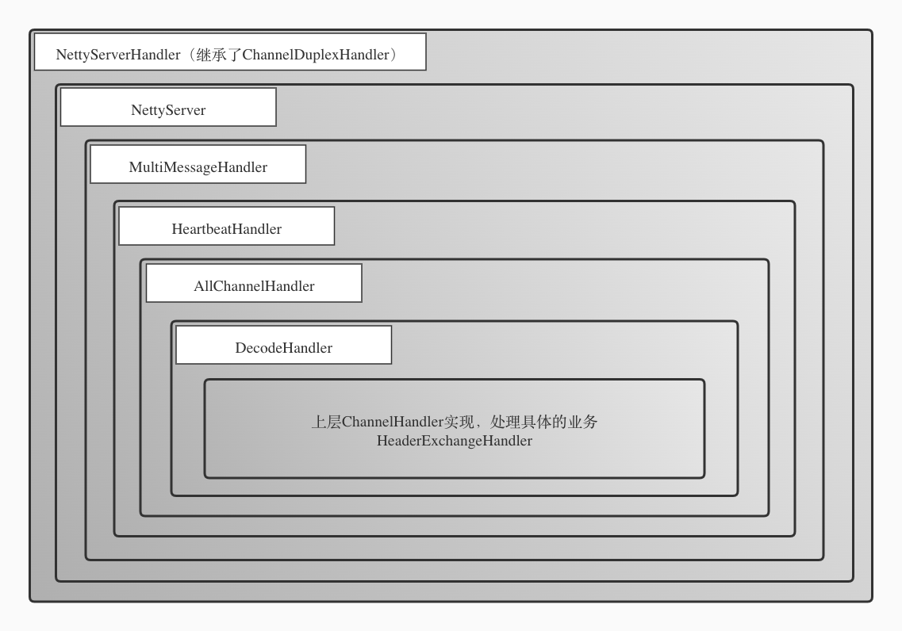

`HeaderExchangeHandler` 会根据本次请求的类型决定如何处理。如果是单向调用，那么只需向后调用即可，不需要返回响应。如果是双向调用，那么就需要在得到具体的调用结果后，封装成 `Response` 对象，并通过持有的 `Channel` 对象将本次调用的响应发送回客户端。

```java
public class HeaderExchangeHandler implements ChannelHandlerDelegate {

    private final ExchangeHandler handler;

    void handleRequest(final ExchangeChannel channel, Request req) throws RemotingException {
        // response id 和请求id一一对应
        Response res = new Response(req.getId(), req.getVersion());
        if (req.isBroken()) {
            // 解码失败，构造失败响应并发送，省略...
        }
        // 获取invocation
        Object msg = req.getData();
        try {
            // 向后调用 org.apache.dubbo.remoting.exchange.support.ExchangeHandlerAdapter.reply
            Object result = handler.reply(channel, msg);
            res.setStatus(Response.OK);
            res.setResult(result);
        } catch (Throwable e) {
            res.setStatus(Response.SERVICE_ERROR);
            res.setErrorMessage(StringUtils.toString(e));
        }
        return res;
    }
  
    @Override
    public void received(Channel channel, Object message) throws RemotingException {
        // provider接收请求： 这里的 message 还是 request，不过其中的 invocation 已经解码好了，要么是在 DubboCodec 中由 I/O 线程解码，要么就是在 DecodeHandler 解码
        // consumer接收响应： message 为 response，里面为 DecodeableRpcResult
        final ExchangeChannel exchangeChannel = HeaderExchangeChannel.getOrAddChannel(channel);
        if (message instanceof Request) {
            Request request = (Request) message;
            if (request.isEvent()) {
                handlerEvent(channel, request);
            } else {
                if (request.isTwoWay()) {
                  // 处理双向请求
                  Response response = handleRequest(exchangeChannel, request);
                  channel.send(response);
                } else {
                   // 单向调用，直接向后调用指定服务即可
                  handler.received(exchangeChannel, request.getData());
                }
            }
        } else if (message instanceof Response) {
            // consumer 处理响应
            handleResponse(channel, (Response) message);
        } else if (message instanceof String) {
            // telnet 相关，省略...
        } 
    }
}
```

`HeaderExchangeHandler` 将调用委托给持有的 `ExchangeHandler` 处理器，这个处理器是和服务暴露时使用的协议有关的，一般来说都是某个协议的内部类。由于默认情况下都是使用的 Dubbo 协议，所以接下来对 Dubbo 协议中的处理器进行分析。

```java
public class DubboProtocol extends AbstractProtocol {

    /** 处理具体业务的处理器 */
    private ExchangeHandler requestHandler = new ExchangeHandlerAdapter() {
        // 省略其它方法...
        @Override
        public Object reply(ExchangeChannel channel, Object message) throws RemotingException {
            if (message instanceof Invocation) {
                Invocation inv = (Invocation) message;
                // 从已暴露的 Exporte r中获取本地 Invoekr
                Invoker<?> invoker = getInvoker(channel, inv);
                // 省略回调相关...
                RpcContext.getContext().setRemoteAddress(channel.getRemoteAddress());
                // 本地调用，返回结果
                return invoker.invoke(inv);
            }
            throw new RemotingException(channel, "Unsupported request: "
                    + (message == null ? null : (message.getClass().getName() + ": " + message))
                    + ", channel: consumer: " + channel.getRemoteAddress() + " --> provider: " + channel.getLocalAddress());
        }
    };
}
```

协议内部的 `ExchangeHandler` 会从已经暴露的服务 `Exporter` 中找到本次调用的 `Invoker`，并且向其发起本地调用。不过要注意的是，这里的 `Invoker` 是一个动态生成的代理对象，类型为 `AbstractProxyInvoker`，它持有了处理业务的真实对象。

当发起 `invoke` 调用时，它会通过持有的真实对象完成调用，并将其封装到 `RpcResult` 对象中并且返回给下层。

```java
public abstract class AbstractProxyInvoker<T> implements Invoker<T> {
    /** 持有的真实对象 */
    private final T proxy;
    /** 接口类型 */
    private final Class<T> type;

    @Override
    public Result invoke(Invocation invocation) throws RpcException {
        try {
            // 发起调用后封装到 RpcResult 中
            return new RpcResult(doInvoke(proxy, invocation.getMethodName(), invocation.getParameterTypes(), invocation.getArguments()));
        } catch (InvocationTargetException e) {
            return new RpcResult(e.getTargetException());
        } catch (Throwable e) {
            throw new RpcException("Failed to invoke remote proxy method " + invocation.getMethodName() + " to " + getUrl() + ", cause: " + e.getMessage(), e);
        }
    }
  
    /** 待子类实现的抽象方法，向真实对象发起具体调用 */
    protected abstract Object doInvoke(T proxy, String methodName, Class<?>[] parameterTypes, Object[] arguments) throws Throwable;
}
```

::: tip
关于 `RpcResult` 有兴趣的话可以了解一下 2.7.x 异步化改造后的变化。简单来说就是 `RpcResult` 被 `AppResonse` 所替代，用来保存调用结果或调用异常，同时引入了一个新的中间状态类 `AsyncRpcResult` 用于代表未完成的RPC调用。
:::

这个代理对象是在服务端进行服务暴露的时候生成的，`javassist` 会动态生成一个 `Wrapper` 类，并且创建一个匿名内部对象，将调用操作委托给 `Wrapper`。

```java
public class JavassistProxyFactory extends AbstractProxyFactory {

    /** 客户端引用服务时生成的代理对象 */
    @Override
    @SuppressWarnings("unchecked")
    public <T> T getProxy(Invoker<T> invoker, Class<?>[] interfaces) {
        return (T) Proxy.getProxy(interfaces).newInstance(new InvokerInvocationHandler(invoker));
    }

    /** 服务端暴露服务时生成的代理对象 */
    @Override
    public <T> Invoker<T> getInvoker(T proxy, Class<T> type, URL url) {
        // 动态生成 Wrapper 类
        final Wrapper wrapper = Wrapper.getWrapper(proxy.getClass().getName().indexOf('$') < 0 ? proxy.getClass() : type);
        return new AbstractProxyInvoker<T>(proxy, type, url) {
            @Override
            protected Object doInvoke(T proxy, String methodName,
                                      Class<?>[] parameterTypes,
                                      Object[] arguments) throws Throwable {
                // 通过 wrapper 对象向真实对象发起调用
                return wrapper.invokeMethod(proxy, methodName, parameterTypes, arguments);
            }
        };
    }

}
```

下面是反编译得到的 `Wrapper` 类，可以看到具体的处理逻辑和客户端的 `InvocationHandler` 类似，都是根据本次调用的方法名来向真实对象发起调用。

```java
public class Wrapper0 extends Wrapper implements ClassGenerator.DC {
    public static String[] pns;
    public static Map pts;
    public static String[] mns;
    public static String[] dmns;
    public static Class[] mts0;

    // 省略其他方法

    public Object invokeMethod(Object object, String string, Class[] arrclass, Object[] arrobject) throws InvocationTargetException {
        DemoService demoService;
        try {
            // 类型转换
            demoService = (DemoService)object;
        }
        catch (Throwable throwable) {
            throw new IllegalArgumentException(throwable);
        }
        try {
            // 根据方法名调用指定的方法
            if ("sayHello".equals(string) && arrclass.length == 1) {
                return demoService.sayHello((String)arrobject[0]);
            }
        }
        catch (Throwable throwable) {
            throw new InvocationTargetException(throwable);
        }
        throw new NoSuchMethodException(new StringBuffer().append("Not found method \"").append(string).append("\" in class com.alibaba.dubbo.demo.DemoService.").toString());
    }
}
```

至此，服务端已完成了调用过程。下层 `ChannelHandler` 收到调用结果后，就会通过 `Channel` 将响应发送回客户端，期间又会经过编码序列化等操作，由于和请求的编码序列化过程类似，这里不再赘述，感兴趣的话可以自行查看 `ExchangeCodec#encodeResponse` 以及 `DubboCodec#encodeResponseData`。

这里再附上一张服务端处理请求的时序图。


### 2.6 客户端处理响应

当客户端收到调用的响应后，毫无疑问依旧需要对收到的字节序列进行解码及反序列化，这里和服务端解码请求的过程是类似的，查看 `ExchangeCodec#decode` 以及 `DubboCodec#decodeBody` 自行了解，也可参考上面的服务端解码请求的时序图，这里只附上一张客户端处理已（部分）解码的响应的时序图。

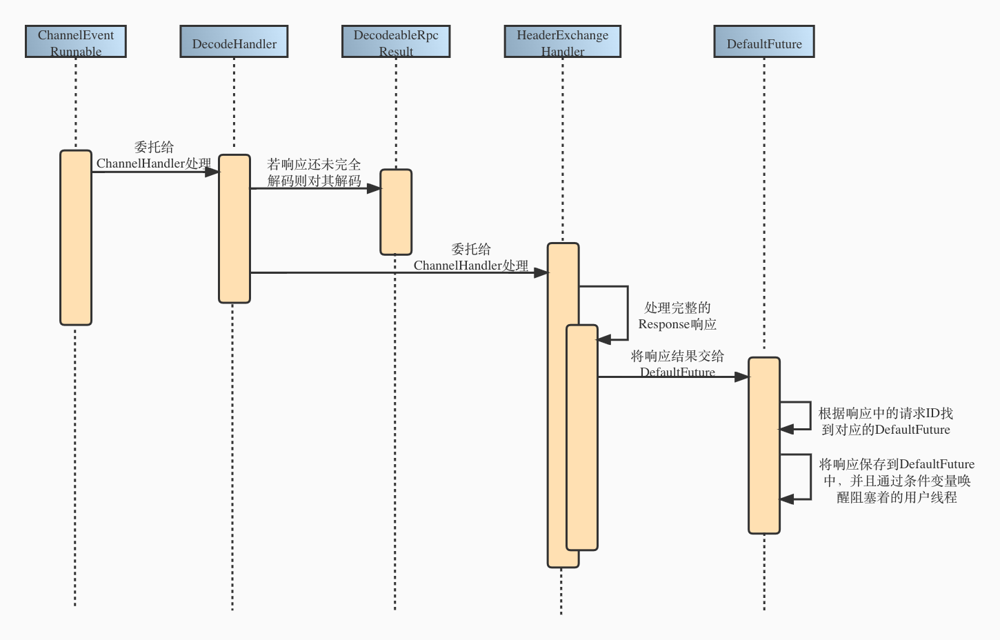

这里主要讲的是客户端对解码后得到 `Reponse` 对象的处理逻辑。在客户端的 `ChannelHandler` 结构和上面的服务端  `ChnnelHandler` 结构图没有太大区别，经过解码后的响应最终也会传递到 `HeaderExchangeHandler` 处理器中进行处理。

```java
static void handleResponse(Channel channel, Response response) throws RemotingException {
  if (response != null && !response.isHeartbeat()) {
    // 将响应传递给 DefaultFuture
    DefaultFuture.received(channel, response);
  }
}
```

在客户端发起请求时我们提到过，每个构造的请求都有一个 ID 标识，当对应的响应返回时，就会把这个 ID 带上。当接收到响应时， Dubbo 会从请求的 Future 映射集合中，根据返回的请求ID，找到对应的 `DefaultFuture`，并将结果设置到 `DefaultFuture` 中，同时唤醒阻塞的用户线程，这样就完成了 Dubbo 的业务线程到用户线程的转化。

```java
public class DefaultFuture implements ResponseFuture {

    private static final Map<Long, DefaultFuture> FUTURES = new ConcurrentHashMap<Long, DefaultFuture>();
    private final Lock lock = new ReentrantLock();
    private final Condition done = lock.newCondition();
    
    @Override
    public Object get(int timeout) throws RemotingException {
        if (timeout <= 0) {
            timeout = Constants.DEFAULT_TIMEOUT;
        }
        if (!isDone()) {
            long start = System.currentTimeMillis();
            lock.lock();
            try {
                while (!isDone()) {
                    // 用于线程发起调用后会阻塞在条件变量上，直到超时或者结果返回
                    done.await(timeout, TimeUnit.MILLISECONDS);
                    if (isDone() || System.currentTimeMillis() - start > timeout) {
                        break;
                    }
                }
            } catch (InterruptedException e) {
                throw new RuntimeException(e);
            } finally {
                lock.unlock();
            }
            if (!isDone()) {
                throw new TimeoutException(sent > 0, channel, getTimeoutMessage(false));
            }
        }
        return returnFromResponse();
    }
  
    public static void received(Channel channel, Response response) {
        try {
            DefaultFuture future = FUTURES.remove(response.getId());
            if (future != null) {
                // 根据请求id找到对应的 Future，并将结果设置进去
                future.doReceived(response);
            } else {
               // 找不到的话说明已经超时了，打印超时警告
            }
        } finally {
            CHANNELS.remove(response.getId());
        }
    }
    private void doReceived(Response res) {
        lock.lock();
        try {
            // 设置响应结果
            response = res;
            if (done != null) {
                // 唤醒用户线程
                done.signal();
            }
        } finally {
            lock.unlock();
        }
        if (callback != null) {
            invokeCallback(callback);
        }
    }
}
```

::: tip
有兴趣的话可以再了解一下 DefauFuture 的超时处理 以及 Dubbo 2.7 异步化改造后的线程模型变化。
:::

最后附上一张来源官网的图。


至此，一个完整的 RPC 调用就结束了。

由于本人水平有限，文中部分细节并没有讲清楚 ，欢迎大家一起交流学习。

## 3. 参考链接

-  [Dubbo 官网 - 服务调用过程](https://dubbo.apache.org/zh/docsv2.7/dev/source/service-invoking-process/) 
-  《深入理解 Apache Dubbo 与实战》 
