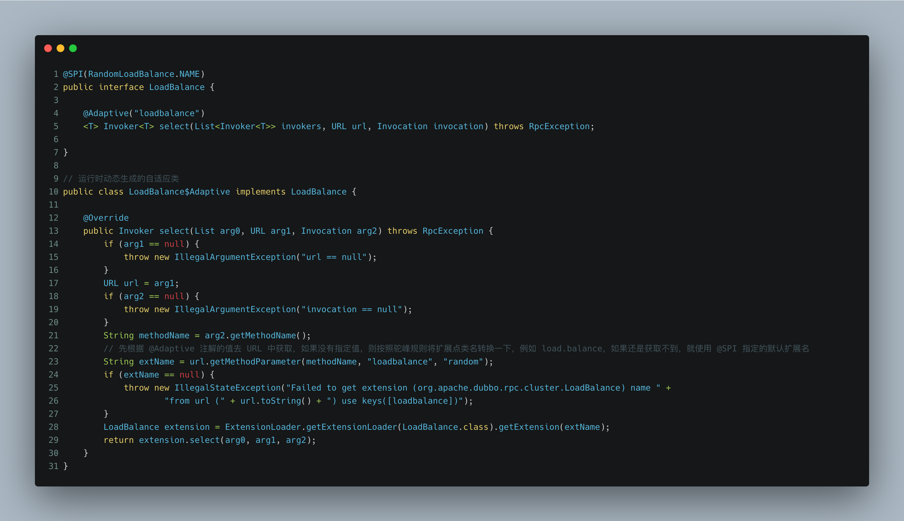

# 0x01 Java SPI
## 0x10 介绍

- 在介绍 SPI 之前，先来看一个简单的场景。在日常开发中，我们一般都会使用 `slf4j` 日志门面接口来获取 `Logger`，而具体使用的是哪个日志实现类其实我们并不关心。但如果此时没有了 `slf4j` 可以使用，那当我们需要使用日志时，我想最简单的方法应该是下图这样子的，简单粗暴地 `new` 一个日志实现类，然后每次更换日志实现类的时候，把要 `new` 的类给替换一下就完事了。


- 这样做的缺点大家都很清楚，那就是直接把实现类硬编码在代码中，耦合度太高了，好点的话可能会使用工厂模式也弄一个 `LoggerFactory` 用于获取日志实例，但是依旧无法避免去维护工厂类的代码，无论是新增实现类还是移除实现类，还是需要对工厂类的代码进行改动。
- 为了解决这个问题，SPI 就可以派上用场了（实际上 `slf4j` 确实在 1.8 版本之后引入了 SPI 机制）。SPI 全称为 _**Service Provider Interface**_ ，是 Java 提供的一套服务发现机制，本质是将接口实现类的全限定名配置在文件中，并由服务加载器读取配置文件，加载实现类。这样可以在运行时，动态为接口替换实现类，可用于解耦、插件的自由插拔等场景。介绍得比较官方，还是以上面的日志为例，来看一下具体的栗子。
- 首先定义好接口以及相关的实现类，如下所示（篇幅原因就放在同一张图了，实际上是分开的）。


- 接着在 `META-INF/services/` 目录下创建配置文件，文件名为接口的全限定类名，也就是 `cn.ykf.spi.service.LogService`，文件内容为实现类的全限定类名。如果有多个实现类的话，使用换行符进行分隔，如下所示。
```
cn.ykf.spi.service.impl.Log4j
cn.ykf.spi.service.impl.Logback
```

- 最后通过 `java.util.ServiceLoader` 来动态地加载实现类。


- 看完例子可能对于实际场景的使用还是有点困惑，接下来看一下 `JDBC` 是怎么使用 `SPI` 机制的。以前我们在使用原生 `JDBC` 来访问数据库的时候，总是需要通过 `DriverManager.getConnection()` 来获取数据库连接，但是为什么 `DriverManager` 会知道我们想要获取的是哪种数据库连接呢？是 `MySQL` 连接？还是 `H2` 连接？其实答案就是 SPI 机制。
- 在 `DriverManager` 类加载的时候，会触发方法 `loadInitialDrivers()` ，而该方法会调用 `ServierLoader` 来查找驱动实现类，进而完成驱动类的加载，最终就可以通过加载到的数据库驱动类来获取数据库连接了，如下图所示。 


---

## 0x11 源码分析

- 从 DEMO 中可以看出，在整个 SPI 机制中，`ServiceLoader` 类就是核心类，因此我们对其进行分析。其实整个流程的原理并不复杂，如下所示：
   - 先根据当前的接口名，到约定好的目录（`META-INF/services`）下查找是否有对应的配置文件。
   - 如果找到配置文件，那么就开始读取配置文件。
   - 逐行解析配置文件，获取配置文件中的所有实现类名，并保存。
   - 当遍历获取实现类时，加载实现类，并实例化返回。
- `ServiceLoader` 内部定义了一个实现 `Iterator` 接口的迭代器，由它来完成具体的类加载操作。具体代码如下（省略了很多代码，只保留关键代码）


---

## 0x12 优缺点

- 优点
   - 解耦。从开发角度一般来说推荐模块间基于接口编程，模块之间不对实现类进行硬编码。通过 Java SPI 机制，我们可以很方便地替换实现类，而不用修改代码。
- 缺点
   - 会一次性实例化（注意是实例化，而不是简单的加载类）所有的扩展点实现类。如果某个扩展点实现类实例化的时候很耗资源，但是又暂时用不上，那么无疑就会增加了资源的开销。
   - 没法按需加载，如果有多个实现类，那么由于配置文件中内容不是 `key-value` 的形式，因此不能精确地加载所需要的实现类。
   - 加载顺序无法保证。举个栗子，对于 `LogService` ，现在 jar 包 A 和 jar 包 B 都定义了其配置文件，在使用 `ServiceLoader` 的迭代器来获取其实现类时，如果默认情况只想要最后一个实现类，那么就和 jar 包的加载顺序有关了。当最后加载的是 jar 包 A，那么最终的实现类就是 A 中的类，当最后加载的是 jar 包 B，那么最终的实现类就是 B 中的类。虽然可以通过 `java -cp A.jar:B.jar` 来指定加载顺序，但是这种依赖 Classpath 的顺序是一种很不严谨的方式。

---

# 0x02 Dubbo SPI
## 0x20 介绍

- 对于一个第三方框架来说，良好的扩展性是必不可少的，因为框架需要允许第三方开发者对其功能进行扩展。但是应该怎么样设计出一个有着良好的可扩展性的框架呢？
- 就拿负载均衡这个功能来说吧，如果实现时 Dubbo 没有使用 SPI 机制的话，那么就会出现开篇提到的问题，直接将要使用的负载均衡策略硬编码在代码中，一方面不方便维护，另一方面也不够灵活。
   - 那么能不能直接使用 Java 的 SPI 呢？其实也是不行的，在上面也提到了，Java 的 SPI 机制并不能实现按需加载，而对于负载均衡来说，正常情况下都是有会多种策略的，例如随机权重策略、最小活跃数策略等等...如果不能根据用户的配置来选择某个策略的话，那么整个框架的设计就不太合理了，总不能想要更改使用的负载均衡策略时还需要去魔改框架的代码吧。
   - 另外就是原生的 Java SPI 没办法和其他框架集成，例如某个实现类中依赖了 Spring Bean，又或者依赖了系统中的其他接口，那么此时是无法为其自动注入依赖的。
- 下图来自于 Dubbo 官网，是一张关于 Dubbo 扩展的应用图。


- 基于以上原因，Dubbo 自己实现了一套 SPI 机制。Dubbo 采用了微内核 + 插件的架构，其中的插件就是通过 Dubbo SPI 机制所引入的，第三方开发者可以很方便地通过该机制来扩展原有功能。也正是因为这样，理解 Dubbo SPI 机制对学习 Dubbo 的源码有很大的帮助。
   - 微内核定义了操作的整体流程，不关心具体的实现逻辑，由插件自己处理。打个比方，从最简单的一次 RPC 调用来说，无非就是消费端从注册中心获取路由信息后封装请求，编码并发送到服务端，服务端接收到请求后进行解码，执行本地调用后封装响应，按照请求发送的流程进行响应的应答。因此，微内核只需要基于接口来定义好这一个流程，至于具体实现时，注册中心是用的 `ZooKeeper` 还是 `Redis`，序列化/反序列化是用的 `Json` 还是 `Hessian`，这个只需要通过插件的形式引入就可以。通过这种设计，既实现了解耦，也方便以后进行扩展。
   - 有点类似于模版模式，模版模式由父类定义某个操作的整体流程，具体步骤则由子类自己实现（参考 `java.util.concurrent.locks.AbstractQueuedSynchronizer#acquire`）。说白了就是都遵守了开闭原则，对扩展开放，对修改关闭。
- 依旧来看一下栗子，还是原本的接口和实现类，只不过接口上增加了 `@SPI("log4j")` 注解，表示这是一个扩展点接口，并且其默认实现类是扩展名为 `log4j` 的实现类。


- 然后在 `META-INF/dubbo/` 目录下创建配置文件，文件名还是为接口的全限定类名，内容则为 `key-value` 的形式，其中 `key` 为该实现类的名称，下文统一简称为扩展名，`value` 则为实现类的全限定类名，如下所示。
```
# 第一个实现类的扩展名为 log4j
log4j=cn.ykf.spi.service.impl.Log4j

# 第二个实现类的扩展名为 logback
logback=cn.ykf.spi.service.impl.Logback
```

   - 顺便提一下，Dubbo 目前支持的配置文件路径有 `MTTA-INF/services/`、`META-INF/dubbo/`、`META-INF/dubbo/internal`，分别对应于 Java SPI 目录，用户自定义插件目录、框架内置插件目录。
- 最后通过 `ExtensionLoader` 来加载扩展(`ExtensionLoader` 相当于 Java SPI 中的 `ServiceLoader`)。


- 优点
   - 弥补了 Java SPI 的缺陷，不会实例化所有的实现类，只会加载实现类并按类别进行缓存，需要某个实现类时再实例化。
   - 可以根据实现类的 key 来按需获取，更加灵活。
   - 增加了自动装配（IOC）、自动包装（AOP）、自动激活、自动适应等特性。
- 扩展点的分类
   - 普通扩展类（自动激活扩展类也属于普通扩展类）
   - 包装扩展类
   - 自适应扩展类

---

## 0x21 自动装配

- Dubbo 通过 SPI 机制实现了简化版的依赖注入，如果类中存在其他扩展点成员，那么在获取扩展点实现时，就会触发依赖注入，来看一下栗子吧。


- 当使用 `ExtensionLoader.getExtention(String name)` 获取扩展点实例时，在实例化之后会通过调用 `ExtensionLoader.injectExtension()` 来完成依赖注入（待注入对象可以是其他的扩展点也可以是 Spring Bean）。该方法会遍历当前实例的所有 setter 方法，当 setter 方法只有一个参数并且没有加上 `@DisableInject` 注解的话，那么就获取对应属性名，根据属性名和类型到 `ExtensionFactory` 中查询对象并注入，类似于 Spring IOC 的自动注入机制。
   - 这里就会有一个问题了，当注入依赖扩展点时，如何决定注入依赖扩展点的哪个实现？那么就需要接下来的自适应机制了。


---

## 0x22 自适应

- 要了解自适应机制，首先要知道什么是自适应类。其实自适应类就是一个代理类，它也是某个扩展点的实现类，但是它不会去实现该扩展点的具体逻辑，它只完成一件事：那就是根据传入的参数动态选择真正要使用的实现类。回到上面的问题，Dubbo 在自动注入其他扩展点的时候，因为不像 Spring 可以用 `@Qualifier` 、`@Resource` 这些注解来显示指定要注入的实例，所以 Dubbo 此时是并不知道要注入哪个实现类的（其实还有一个更重要的原因就是 Dubbo 就不想只注入某个固定的扩展类，因为不够灵活，可以了解一下 `ServiceConfig` 中服务暴露时是怎么使用自适应 `Protocol` 的），最好的方法就是注入一个代理类，等到真正需要用到该扩展的时候，再由代理类去动态选择真正的实现类。从 Dubbo 的源码中可以看到就是这么设计的。


- 在自适应机制中最重要的机制就是 `@Adaptive` 注解，该注解可以标注在类上，表示这是一个自适应的代理类。但是整个 Dubbo 中只有 `AdaptiveExtensionFactory` 和 `AdaptiveCompiler` 类加了该注解，可以看下 `AdaptiveExtensionFactory` 的源码，其实就是持有了其他的 `ExtensionFactory` 实例，例如上面的 `SpiExtensionFactory` 类。
   - 这里有个小细节，当调用 `ExtensionLoader.getSupportedExtension()` 时，底层会使用 `TreeSet` 对扩展名进行排序，所以这里最终是 `spi` 扩展在前，`spring` 扩展在后。


- 其实 `@Adaptive` 注解最主要的作用还是加在扩展点的方法上，例如 Dubbo 的协议扩展点 `Protocol` 、负载均衡扩展点 `LoadBalance` 都是这样使用的。当扩展点方法加上 `@Adaptive` 后，在运行时 Dubbo 会根据注解动态编译一个自适应类。来看一下栗子，以 `Loadbalance` 扩展点为例，其 `select` 方法加了 `@Adaptive` 注解，注解的 `value` 值代表运行时从 `URL` 动态获取扩展名的参数 `key`，也就是说，运行的时候 Dubbo 会生成一个自适应类，这个自适应类会根据 `loadbalance` 这个参数到 `URL` 参数中找对应的值，如果 `URL` 中有对应的参数值，那么就用这个参数值来获取真正的实现类。
   - `URL` 是整个 Dubbo 的配置总线，所有的扩展点都可以直接或间接的获取到它，它作为上下文信息贯穿整个扩展点设计体系，因此可以从中获取到我们想要的配置信息。



- 这种动态查找实现类的方式很灵活，但是只能使用具体的一个实现类，假如需要多个实现类同时被激活，那么又该怎么办？这就涉及到了另外一个特性——自动激活。

---

## 0x23 自动激活

- 在发起一次远程调用时，根据 Dubbo 的架构分层来看，当调用到达 `Protocol` 层时，会先经过一个 `Filter` 链，用于执行一些预处理。那么当我们想要扩展这个 `Filter` 链时，自动激活的特性就可以派上用场了，只需要编写一个使用 `@Activate` 指定了激活条件的 `Filter` 实现类，并且增加配置文件即可。
-  `@Activate` 常用的属性分别是：
   - `group` ——表示在哪个端生效，可选值 `provider` 和 `consuemr`。
   - `value` ——表示在 URL 参数中出现该扩展才会被激活。
   - `order` ——表示优先级，值越小越优先。
-  看一下 Dubbo 内置的 `Filter` 实现类，可以看到类上使用了 `@Activate` 标注，激活条件是在服务提供端生效，并且 `URL` 中含有 `token` 参数。当 Dubbo 在服务暴露或者服务引用的时候会通过 `ExtensionLoader.getExtensionLoader(Filter.class).getActivateExtension()` 来获取符合条件被自动激活的 `Filter` 扩展实现类，因此自定义的 `Filter` 实现类就可以生效了。


- 自动激活的原理也很简单，就是在获取自动激活实例的时候，根据传入的 `URL` 、待激活的扩展名等去判断所有带有 `@Activate` 注解的类中，有哪些是激活条件的，符合条件的话就实例化并返回。


## 0x24 自动包装

- 什么是包装扩展类呢？包装扩展类本身为某个扩展点的实现类，其构造函数只有一个参数，并且参数类型就是该扩展点。它的用途就是封装一些公共操作，比如一个扩展点的多个实现类有一些公共操作，为了代码复用，就可以把这些公共操作提取到包装类中，下图就是一个包装类。


- 自动包装特性就是，当通过 `ExtensionLoader.getExtension()` 获取扩展时，在实例化实现类并完成自动装配后，会对该实例使用包装类进行包装，因此可以把一些通用的逻辑操作放在包装类中，类似于简化版的 Spring AOP 机制（其实就是装饰者模式）。
- 简单看一下源码的实现，没什么特殊的，就是通过反射实例化包装类而已。


---

# 0x03 题外话
## 0x31 Spring SPI

- 这个算是题外话了，其实 Spring 也有着自己的一套 SPI 机制，就是 `spring.handlers` 和 `spring.factories` 。前者可以见 Dubbo 的配置文件解析，后者见 Spring Boot 的自动配置。
- 当 Spring 解析 XML 配置时，发现某个标签不属于当前的命名空间，那么就会到 `META-INF/spring.handlers` 下根据当前的命名空间找对应的标签解析器，再由指定的标签解析器去解析对应标签。所以个人觉得这也是一种 SPI 机制的实现，只不过是命名空间和解析器实现的映射。
- `spring.factories` 更加简单粗暴，直接把所有的扩展都放在同一个文件里，key 为接口，value 则为对应的实现类集合，通过 `org.springframework.core.io.support.SpringFactoriesLoader#loadFactories` 来获取对应的实现类，源码灰常简单粗暴，只是简单读取文件并获取实现类名而已，有兴趣的可以自己了解下，这里就不多讲了。


---

## 0x32 注册信息简化踩坑

- 如果在配置文件中使用 `<dubbo:registry address="${dubbo.registry.address}" check="false" simplified="true"/>` 开启了注册信息简化，但是没有通过 `extra-keys` 属性指定要保留的配置时，那么就有可能因为注册信息简化导致某些配置被忽略了。
- 举个例子，配置文件中配置了重试次数为 0，运行服务后到 zk 中看一下对应服务 `providers` 节点下的注册信息，下面分别是简化前和简化后的 `URL` 信息（注意简化前的 `URL` 是存在 `retries=0` 这个配置项的）。
```bash
# 简化后的URL信息
dubbo://127.0.0.1:20881/cn.ykf.service.GoodsService?application=goods-module&cluster=failover&deprecated=false&dubbo=2.0.2&loadbalance=roundrobin&release=2.7.7&timeout=2000&timestamp=1620717688425&token=6607d513-2196-4029-b099-cb9753076edc

# 简化前的URL信息
dubbo://127.0.0.1:20881/cn.ykf.service.GoodsService?anyhost=true&application=goods-module&cluster=failover&deprecated=false&dubbo=2.0.2&dynamic=true&generic=false&interface=cn.ykf.service.GoodsService&loadbalance=roundrobin&metadata-type=remote&methods=testSimplified&pid=22543&release=2.7.7&retries=0&side=provider&timeout=2000&timestamp=1620717688425&token=6607d513-2196-4029-b099-cb9753076edc
```

- 当使用 `simplified="true"` 开启注册信息简化时，默认情况下，服务暴露的时候 `URL` 保留的注册信息如下表，见 `org.apache.dubbo.registry.integration.RegistryProtocol#DEFAULT_REGISTER_PROVIDER_KEYS`。

::: center

| **Constant Key** | **Key** | **remark** |
| --- | --- | --- |
| APPLICATION_KEY | application |  |
| CODEC_KEY | codec |  |
| EXCHANGER_KEY | exchanger |  |
| SERIALIZATION_KEY | serialization |  |
| CLUSTER_KEY | cluster |  |
| CONNECTIONS_KEY | connections |  |
| DEPRECATED_KEY | deprecated |  |
| GROUP_KEY | group |  |
| LOADBALANCE_KEY | loadbalance |  |
| MOCK_KEY | mock |  |
| PATH_KEY | path |  |
| TIMEOUT_KEY | timeout |  |
| TOKEN_KEY | token |  |
| VERSION_KEY | version |  |
| WARMUP_KEY | warmup |  |
| WEIGHT_KEY | weight |  |
| TIMESTAMP_KEY | timestamp |  |
| DUBBO_VERSION_KEY | dubbo |  |
| SPECIFICATION_VERSION_KEY | specVersion | 新增，用于表述dubbo版本，如2.7.0 |

:::

- 可以看到，默认情况下是不会保留重试次数 `retries` 的配置项的，这一点从简化后的 `URL` 也可以看出来。

- 因此，这就有可能导致一种情况。当消费端没有显式指定重试次数时，由于服务引用时会从注册中心获取 `URL` 信息，而此时注册中心保存的是开启注册信息简化后的 `URL`，并没有重试次数配置。因此，当远程调用出现异常时，就会使用默认的重试次数配置（默认情况下含重试共调用 3 次），出现了期望外的重复调用。

- 解决方案
   - 采用 `extra-keys` 指定要保留的配置 `key`，例如 `<dubbo:registry address="${dubbo.registry.address}" check="false" simplified="true" extra-keys="retries, type"/>`

- [关于注册信息简化的演示DEMO](https://github.com/yyykf/demo-all/blob/master/dubbo-demo/provider/src/main/java/cn/ykf/ProviderApplication.java)

# 0xff 参考资料

- 《深入理解 Apache Dubbo 与实战》
- [segmentfault - JDK/Dubbo/Spring 三种 SPI 机制，谁更好？](https://segmentfault.com/a/1190000039812642?utm_source=weekly&utm_medium=email&utm_campaign=SegmentFault%20%E7%B2%BE%E9%80%89%E6%AF%8F%E5%91%A8%E7%B2%BE%E9%80%89%E4%B8%A8%E5%85%B3%E4%BA%8E%20Spring%20%E4%B8%AD%20getBean%20%E7%9A%84%E5%85%A8%E6%B5%81%E7%A8%8B%E6%BA%90%E7%A0%81%E8%A7%A3%E6%9E%90%E4%B8%A8%E4%BD%BF%E7%94%A8%20JavaScript%20%E5%AD%A6%E4%B9%A0%E8%AE%BE%E8%AE%A1%E6%A8%A1%E5%BC%8F)
- [Dubbo官网 - 注册信息简化](https://dubbo.apache.org/zh/docs/v2.7/user/examples/simplify-registry-data/)
- [Dubbo官网 - Dubbo 中的 URL 统一模型](https://dubbo.apache.org/zh/blog/2019/10/17/dubbo-%E4%B8%AD%E7%9A%84-url-%E7%BB%9F%E4%B8%80%E6%A8%A1%E5%9E%8B/)
- [Dubbo官网 - Dubbo可扩展机制实战（墙裂推荐这篇文章！）](https://dubbo.apache.org/zh/blog/2019/04/25/dubbo%E5%8F%AF%E6%89%A9%E5%B1%95%E6%9C%BA%E5%88%B6%E5%AE%9E%E6%88%98/)
