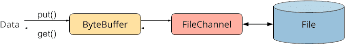
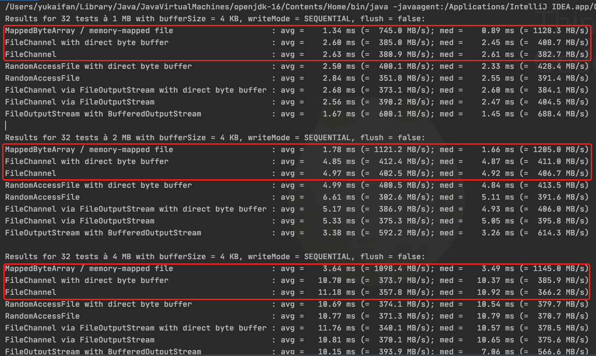
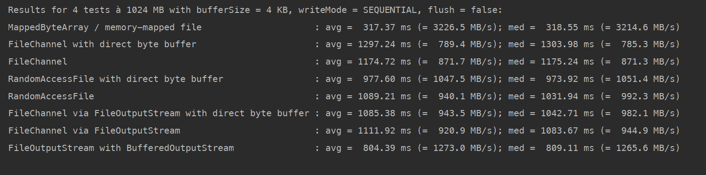

### 术语

1. 什么是 FileChannel

NIO 中的概念，可以理解为连接文件/Socket的一根管道。和单向的 `InputStream`或 `OutputStream` 不一样，它是双向（bidirectional）的，也就是说可以通过 `FileChannel` 直接完成文件的读取/写入。

2. 什么是 ByteBuffer

NIO 中的概念，其实就是一个字节数组，它封装了一些读写数据的方法。要和 `FileChannel`进行数据交互的话，就需要通过 `ByteBuffer`。可以把 `FileChannel` 理解为铁轨，而 `ByteBuffer` 就是一辆载满人在上面行驶的火车，负责将人从一个站点送往另一个站点。

想要往文件中写入数据时，就需要通过 `ByteBuffer.put()` 将数据放入字节数组中，紧接着通过 `FileChannel.write(buffer)` 将数据写入到文件中，`FileChannel`底层其实会调用 `ByteBuffer.get()`将字节数组中`put()` 放入的数据读取出来。

而当想要从文件中读取数据时，就需要通过 `ByteBuffer.read(buffer)`，该方法底层调用 `ByteBuffer.put()` 将读取到的数据放入字节数组中，紧接着就可以通过 `ByeBuffer.get()` 获取到了。

因此，`ByteBuffer` 就是一个数据的载体，用于传输数据，类似于火车载人。

::: center

:::

3. 什么是 MappedByteBuffer

一种特殊的字节数组，它可以把文件的某块区域映射到用户内存空间中（Page Cache），读写该字节数组相当于读写文件，操作系统会自动将变更进行刷盘。与传统读写方式的用户态/内核态来回拷贝数据相比，该方式直接读取用户态的数据即可。

### FileChannel 的优势

相比 `InputStream` 和 `OutputStream`，`FileChannel` 有以下优势：

- 可以读写文件中任意位置的数据。

- 可以通过其 `force` 方法强制将文件的变更从缓冲区（PageCache）中刷到硬盘。

- 可以通过 `map` 方法将文件的某块区域映射到内存中，方便读写。

- 可以通过 `lock` 方法对文件的某块区域进行加上共享锁或排它锁，防止其他线程同时操作。

- 可以非常高效地将数据从一个通道转移到另一个通道中，例如文件拷贝。

### FileChannel 的一些操作

- 可以通过 `FileChannel.open()`、`FileInputStream.getChannel()`或者 `RandomAccessFile.getChannel`来获取文件通道。对于第二种方式来说，获取到的通道的读写标志只能设置为只读，而对于最后一种方式来说则可以被设置为读写。

- 扩展文件，当打开文件通道后，往指定位置写入数据时，如果当前文件大小还没有那么大，那么文件就会自动扩容到指定的位置大小，不过中间会出现一些文件空洞，就是数据都是0。

- 缩小文件，可以通过 `FileChannel.truncate(size)` 将文件缩小为指定大小，如果 `size` 大于或等于当前文件大小，那么该调用无效，不会有任何影响。

- 通过 `FileChannel.force(boolean metaData` 会触发操作系统去刷盘，将其缓存在缓存区中的变更应用到硬盘上。其参数 `metaData` 指示是否需要将文件的元数据也立刻刷盘，即文件修改时间等信息，会增加更多的耗时，一般来说不需要。

### MappedByteBuffer 的一些注意点

- 在映射文件的时候必须制定映射区域。当映射 `a.txt` 的前 256 个字节时，如果 `a.txt` 文件不存在，那么映射会创建一个大小为 256 字节的文件；如果文件大小不足 256 个字节，那么会自动扩展到 256 个字节大小；如果文件大小大于 256 个字节，那就只映射前 256 个字节。

- 每次映射最多只能映射 `2G` 大小的文件。

- `MappedByteBuffer`没有实现 `Closeable`接口，所以不能使用 `try-with-resources` 方式实现自动关闭映射。默认情况下，只有当该缓冲区对象处于 `phantom reachable`时，其关联的 `Cleaner` 才会自动去释放映射的内存。不过可以通过 `sun.misc.UnSafe` 来手动释放该部分内存。

### FileChannel 和 MappedByteBuffer 写入速度

- 根据参考链接中作者的测试结果，在顺序写的时候，当文件大小小于 8MB，不管使用的缓冲区是多大的，`MappedByteBuffer` 写入速度永远是最快的，和本机测试结果一致。同时，根据作者所说，在 16 MB文件大小时，只有缓冲区大小为 16KB 时 `MappedByteBuffer` 才会更快。不过经过本机测试，即使文件大小达到了 1GB，写速度始终是 `MapepdByteBuffer` 更快，只不过超过 64MB 时 `FileChannel`的速度才勉强与 `MappedByteBuffer` 持平。

   - 

   - 上面的运行结果是在 MacOS 测试的，而下图则是 Windows 中测试的，两台机器的硬盘是一样的，有点惊到我了，`MappedByteBuffer`直接秒杀其他方式。

   - 

- 而关于随机写的速度，似乎始终是 `MappedByteBuffer` 更快。

- 如果感兴趣的话，可以点击参考链接看原作者的评测结果，非常棒的一篇文章。下面附上原作者整理的测试结果，来源：[Java file write performance](https://docs.google.com/spreadsheets/d/1OkrQVIgEPjXfEIapsSJS1m59xjte3GZC2YeJcNq_728/edit#gid=0)

### 参考链接

- [FileChannel, ByteBuffer, Memory-Mapped I/O, Locks [Java Files Tutorial, Part 6]](https://www.happycoders.eu/java/filechannel-bytebuffer-memory-mapped-file-locks/)
