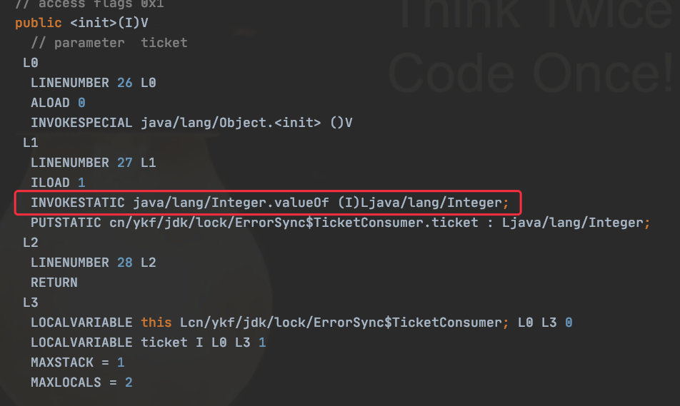

吃早餐的时候看了一篇推文，是在讲关于 `Integer` 对象作为 `sychronized` 的锁对象时存在的问题，下面通过一段代码来复现该问题。
```java
public class ErrorSync {

    public static void main(String[] args) {
        final Thread a = new Thread(new TicketConsumer(10), "A");
        final Thread b = new Thread(new TicketConsumer(10), "B");
        a.start();
        b.start();
    }

    private static class TicketConsumer implements Runnable {

        private static volatile Integer ticket;

        public TicketConsumer(int ticket) {
            TicketConsumer.ticket = ticket;
        }

        @Override
        public void run() {
            while (true) {
                System.out.printf("%s开始抢第%d张票，待加锁对象hashCode为%d%n", Thread.currentThread().getName(), ticket,
                        System.identityHashCode(ticket));
                // 开始对第n张票加锁，期望只有一个线程能进入同步块
                synchronized (ticket) {
                    if (ticket <= 0) {
                        return;
                    }
                    System.out.printf("%s抢到了第%d张票，当前锁对象hashCode为%d%n", Thread.currentThread().getName(), ticket,
                            System.identityHashCode(ticket));
                    try {
                        // 模拟抢票耗时
                        TimeUnit.SECONDS.sleep(1);
                    } catch (InterruptedException e) {
                        e.printStackTrace();
                    }
                    System.out.printf("%s抢到第%d张票后对票数减一%n", Thread.currentThread().getName(), ticket--);
                }
            }
        }
    }
}
```
上面的代码模拟了多线程抢票的过程，这里我们重点注意 `synchronized` 块，原本是期望每张票只有一个线程可以抢到票，但是运行结果却和预期不一致，如下图所示。

::: center

:::

可以看到，一开始两个线程都在抢第 10 张票，并且只有线程 A 抢到了，符合预期。但是下面红框的部分就变成了两个线程都同时抢到了第 9 张票，看起来就是 `synchronized` 失效了，这是为什么？

为了方便排查，可以把模拟抢票的耗时设置更长一点，然后分别在抢第 10 张票和第 9 张票时对线程进行 Dump，看看两个线程的情况，下面是我 Dump 后筛选出来的结果。
```java
// 第一次dump

"B" #21 prio=5 os_prio=31 tid=0x00007fee948e7800 nid=0x9903 waiting for monitor entry [0x000070000d641000]
   java.lang.Thread.State: BLOCKED (on object monitor)
	at cn.ykf.jdk.lock.ErrorSync$TicketConsumer.run(ErrorSync.java:47)
	- waiting to lock <0x000000076ab34428> (a java.lang.Integer)
	at java.lang.Thread.run(Thread.java:748)

"A" #20 prio=5 os_prio=31 tid=0x00007fee9087a800 nid=0x6503 waiting on condition [0x000070000d53e000]
   java.lang.Thread.State: TIMED_WAITING (sleeping)
	at java.lang.Thread.sleep(Native Method)
	at java.lang.Thread.sleep(Thread.java:340)
	at java.util.concurrent.TimeUnit.sleep(TimeUnit.java:386)
	at cn.ykf.jdk.lock.ErrorSync$TicketConsumer.run(ErrorSync.java:54)
	- locked <0x000000076ab34428> (a java.lang.Integer)
	at java.lang.Thread.run(Thread.java:748)


// 第二次dump

"B" #21 prio=5 os_prio=31 tid=0x00007fee948e7800 nid=0x9903 waiting on condition [0x000070000d641000]
   java.lang.Thread.State: TIMED_WAITING (sleeping)
	at java.lang.Thread.sleep(Native Method)
	at java.lang.Thread.sleep(Thread.java:340)
	at java.util.concurrent.TimeUnit.sleep(TimeUnit.java:386)
	at cn.ykf.jdk.lock.ErrorSync$TicketConsumer.run(ErrorSync.java:54)
	- locked <0x000000076ab34428> (a java.lang.Integer)
	at java.lang.Thread.run(Thread.java:748)

"A" #20 prio=5 os_prio=31 tid=0x00007fee9087a800 nid=0x6503 waiting on condition [0x000070000d53e000]
   java.lang.Thread.State: TIMED_WAITING (sleeping)
	at java.lang.Thread.sleep(Native Method)
	at java.lang.Thread.sleep(Thread.java:340)
	at java.util.concurrent.TimeUnit.sleep(TimeUnit.java:386)
	at cn.ykf.jdk.lock.ErrorSync$TicketConsumer.run(ErrorSync.java:54)
	- locked <0x000000076ab34418> (a java.lang.Integer)
	at java.lang.Thread.run(Thread.java:748)
       
```
可以看到，当第一次 dump 时，`ticket == 10`，此时线程 A 抢到了锁 `0x000000076ab34428`，而线程 B 正在等待 `0x000000076ab34428`，两个线程抢占同一个锁对象，满足互斥条件，最终只有一个线程可以抢到第 10 张票，一点问题都没有。但是，当第二次 dump 时， `ticket == 9`，此时线程 A 抢到了锁 `0x000000076ab34418`，而线程 B 也抢到了锁，地址为 `0x000000076ab34428`，两个锁并不是同一个对象，不满足互斥条件，因此就出现了上述的结果。

来分析一下为什么会出现这个情况，结合两个线程的持锁情况我们可以发现。当 `ticket == 10` 时，两个线程都在竞争 `Integer(10)` 这个锁对象，地址为 `0x000000076ab34428`，此时线程 A 抢到该锁进入临界区后执行了 `ticket--`，使 `ticket == 9`，接着线程 A 就释放了 `Integer(10)` 这个锁对象。而由于线程 B 此时已经在 `Integer(10)` 关联的监视器的 `_EntryList` 中等待着，所以线程 B 在线程 A 释放锁后也抢到了 `Integer(10)` 的对象锁。

而对于线程 A，由于 `ticket == 9`，因此会尝试对 `Integer(9)` 进行加锁，所以最终两个线程分别拥有了各自的锁，也就出现了上面两个线程同时抢到同一张票的情况。

这里再提一点，锁对象会发生改变的原因就是因为 `ticket--` 触发了拆箱和装箱，最终调用了 `Integer.valueOf()`，因此返回了一个新的对象。

::: center


:::

#### 相关资料

- [Synchronized Integer的问题](https://segmentfault.com/q/1010000041286379)
- [Synchronizing on an Integer value [duplicate]](https://stackoverflow.com/questions/659915/synchronizing-on-an-integer-value)

