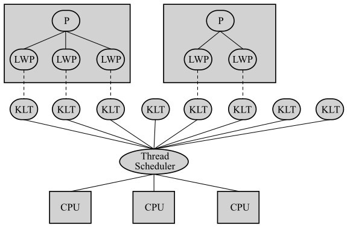
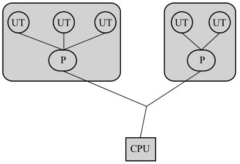
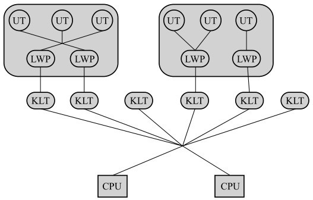

### 1. 线程的实现

#### 1.1 使用内核线程实现（1:1）
内核线程（Kernel-Level Thread，KLT）指的是由操作系统内核直接管理的线程，内核通过调度器（Scheduler）来对其进行调度。内核线程是属于比较底层的实现，因此程序一般不会直接使用它，而是使用它的一种高级接口——轻量级进程（Light Weight Process，LWP）。

每个 LWP 底层都有一个内核线程，因此它可以成为一个独立的调度单元。

不过，正是由于 LWP 是基于内核线程实现的，所以就会涉及到系统调用（System Call），也就是存在用户态（User Mode）、内核态（Kernel Mode）的切换，同时，每个 LWP 都会消耗一定的内核资源（例如内核线程的栈空间），这是该实现方式的局限性。

#### 1.2 使用用户线程实现（1:N）
从广义上来讲，除了内核线程之外的线程都可以认为是用户线程（User Thread，UT），也就是上面的 LWP 其实也可以算是 UT。

而从狭义上来讲，用户线程（指的是完全建立在用户空间的线程库上，系统内核无法感知其存在。这样做的好处是，由于不需要系统调用，因此会少了很多资源开销。但是，由于没有内核线程的支撑，所以需要自己实现线程的调度，通信，创建，销毁等步骤，复杂性会大大提高。

#### 1.3 使用用户线程加轻量级进程混合实现（N：M）
既保留了用户线程具有的较低的创建、销毁等资源开销的优点，同时由于 LWP 和 KLT 的存在，因此可以使用内核的线程调度和处理器映射等功能，而且系统调用可以通过 LWP 来进行，不需要太过担心整个进程被阻塞的问题。

### 2. Java 线程的实现
在 JDK 1.2 之前，Java 线程是基于称为“绿色线程”（Green Thread）的用户线程实现的，不过在 JDK 1.2 及之后，Java 线程就变成了基于操作系统原生线程模型来实现了。在不同的操作系统中，具体的实现可能会由于底层的线程模型而有所差异，不过这些差异无非体现在线程规模和操作成本上，对于程序的编码来说是透明的。

以 HotSpot 虚拟机为例，其 Windows 版本和 Linux 版本都是使用一对一的线程模型实现的，一条 Java 线程就映射到一个操作系统原生线程。而在 Solaris 平台中，由于其底层的线程模型支持多对多，因此 Java 线程模型也可以使用多对多来实现。

### 参考资料

- 《深入理解Java虚拟机：JVM高级特性与最佳实践（第2版）12.4 Java与线程 》
