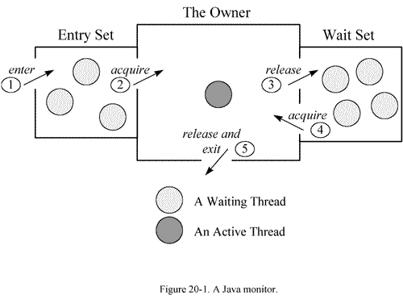
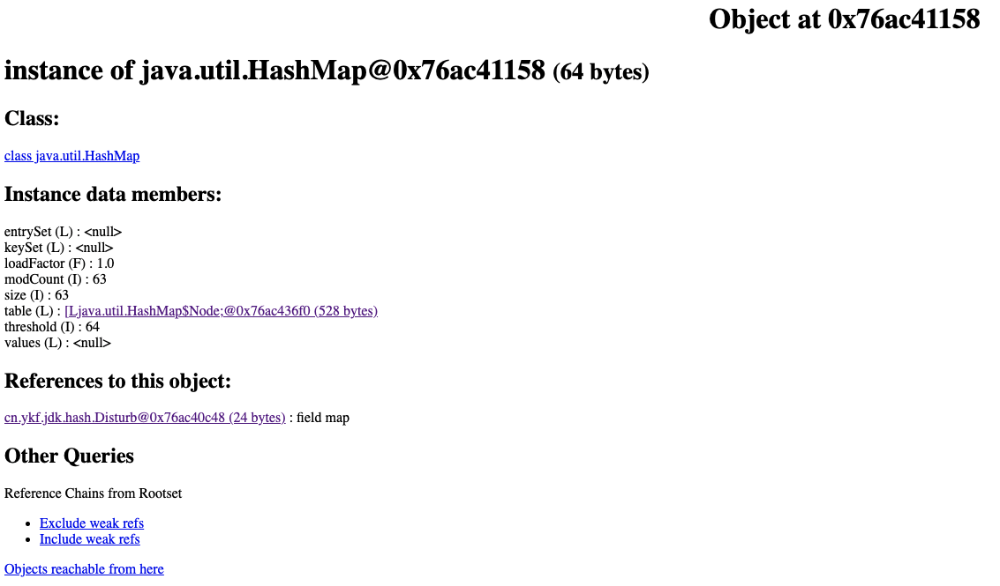
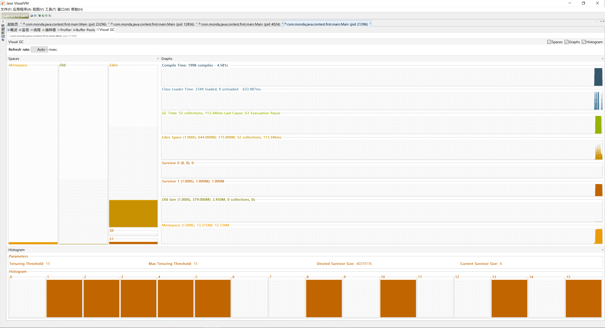

## 1. jstack 命令
用于生成虚拟机当前时刻的线程快照信息，即线程正在执行的方法堆栈信息，可用于定位线程间死锁、死循环、长时间等待等问题。

::: details jstack 示例

```bash
$ jstack 56004 
2021-12-23 16:23:28
Full thread dump Java HotSpot(TM) 64-Bit Server VM (25.271-b09 mixed mode):

"Attach Listener" #22 daemon prio=9 os_prio=31 tid=0x00007fe506115000 nid=0x6603 waiting on condition [0x0000000000000000]
   java.lang.Thread.State: RUNNABLE

"DestroyJavaVM" #21 prio=5 os_prio=31 tid=0x00007fe50700c800 nid=0xf03 waiting on condition [0x0000000000000000]
   java.lang.Thread.State: RUNNABLE

"Thread-1" #20 prio=5 os_prio=31 tid=0x00007fe507160000 nid=0x6403 waiting for monitor entry [0x000070000b3dc000]
   java.lang.Thread.State: BLOCKED (on object monitor)
	at cn.ykf.jdk.hash.Disturb.lockB(Disturb.java:79)
	- waiting to lock <0x000000076ac41138> (a java.lang.Object)
	- locked <0x000000076ac41148> (a java.lang.Object)
	at cn.ykf.jdk.hash.Disturb$$Lambda$2/189568618.run(Unknown Source)
	at java.lang.Thread.run(Thread.java:748)

"Thread-0" #19 prio=5 os_prio=31 tid=0x00007fe50715c800 nid=0x9903 waiting for monitor entry [0x000070000b2d9000]
   java.lang.Thread.State: BLOCKED (on object monitor)
	at cn.ykf.jdk.hash.Disturb.lockA(Disturb.java:66)
	- waiting to lock <0x000000076ac41148> (a java.lang.Object)
	- locked <0x000000076ac41138> (a java.lang.Object)
	at cn.ykf.jdk.hash.Disturb$$Lambda$1/1915910607.run(Unknown Source)
	at java.lang.Thread.run(Thread.java:748)

"Service Thread" #18 daemon prio=9 os_prio=31 tid=0x00007fe505837800 nid=0x6303 runnable [0x0000000000000000]
   java.lang.Thread.State: RUNNABLE

"C1 CompilerThread11" #17 daemon prio=9 os_prio=31 tid=0x00007fe505847800 nid=0x6203 waiting on condition [0x0000000000000000]
   java.lang.Thread.State: RUNNABLE

"C1 CompilerThread10" #16 daemon prio=9 os_prio=31 tid=0x00007fe50b830800 nid=0x6003 waiting on condition [0x0000000000000000]
   java.lang.Thread.State: RUNNABLE

"C1 CompilerThread9" #15 daemon prio=9 os_prio=31 tid=0x00007fe50b830000 nid=0x9f03 waiting on condition [0x0000000000000000]
   java.lang.Thread.State: RUNNABLE

"C1 CompilerThread8" #14 daemon prio=9 os_prio=31 tid=0x00007fe50b82f000 nid=0x5e03 waiting on condition [0x0000000000000000]
   java.lang.Thread.State: RUNNABLE

"C2 CompilerThread7" #13 daemon prio=9 os_prio=31 tid=0x00007fe50b82e800 nid=0x5c03 waiting on condition [0x0000000000000000]
   java.lang.Thread.State: RUNNABLE

"C2 CompilerThread6" #12 daemon prio=9 os_prio=31 tid=0x00007fe50b82d800 nid=0xa103 waiting on condition [0x0000000000000000]
   java.lang.Thread.State: RUNNABLE

"C2 CompilerThread5" #11 daemon prio=9 os_prio=31 tid=0x00007fe50b82d000 nid=0xa203 waiting on condition [0x0000000000000000]
   java.lang.Thread.State: RUNNABLE

"C2 CompilerThread4" #10 daemon prio=9 os_prio=31 tid=0x00007fe50b824000 nid=0xa303 waiting on condition [0x0000000000000000]
   java.lang.Thread.State: RUNNABLE

"C2 CompilerThread3" #9 daemon prio=9 os_prio=31 tid=0x00007fe50b009800 nid=0x5903 waiting on condition [0x0000000000000000]
   java.lang.Thread.State: RUNNABLE

"C2 CompilerThread2" #8 daemon prio=9 os_prio=31 tid=0x00007fe505846800 nid=0x5803 waiting on condition [0x0000000000000000]
   java.lang.Thread.State: RUNNABLE

"C2 CompilerThread1" #7 daemon prio=9 os_prio=31 tid=0x00007fe50b823000 nid=0xa603 waiting on condition [0x0000000000000000]
   java.lang.Thread.State: RUNNABLE

"C2 CompilerThread0" #6 daemon prio=9 os_prio=31 tid=0x00007fe50b808800 nid=0xa703 waiting on condition [0x0000000000000000]
   java.lang.Thread.State: RUNNABLE

"Monitor Ctrl-Break" #5 daemon prio=5 os_prio=31 tid=0x00007fe50710f800 nid=0xa903 runnable [0x000070000a3ac000]
   java.lang.Thread.State: RUNNABLE
	at java.net.SocketInputStream.socketRead0(Native Method)
	at java.net.SocketInputStream.socketRead(SocketInputStream.java:116)
	at java.net.SocketInputStream.read(SocketInputStream.java:171)
	at java.net.SocketInputStream.read(SocketInputStream.java:141)
	at sun.nio.cs.StreamDecoder.readBytes(StreamDecoder.java:284)
	at sun.nio.cs.StreamDecoder.implRead(StreamDecoder.java:326)
	at sun.nio.cs.StreamDecoder.read(StreamDecoder.java:178)
	- locked <0x000000076aca64b0> (a java.io.InputStreamReader)
	at java.io.InputStreamReader.read(InputStreamReader.java:184)
	at java.io.BufferedReader.fill(BufferedReader.java:161)
	at java.io.BufferedReader.readLine(BufferedReader.java:324)
	- locked <0x000000076aca64b0> (a java.io.InputStreamReader)
	at java.io.BufferedReader.readLine(BufferedReader.java:389)
	at com.intellij.rt.execution.application.AppMainV2$1.run(AppMainV2.java:61)

"Signal Dispatcher" #4 daemon prio=9 os_prio=31 tid=0x00007fe50582b800 nid=0x3603 runnable [0x0000000000000000]
   java.lang.Thread.State: RUNNABLE

"Finalizer" #3 daemon prio=8 os_prio=31 tid=0x00007fe50500a000 nid=0x4403 in Object.wait() [0x000070000a0a0000]
   java.lang.Thread.State: WAITING (on object monitor)
	at java.lang.Object.wait(Native Method)
	- waiting on <0x000000076ab08ee0> (a java.lang.ref.ReferenceQueue$Lock)
	at java.lang.ref.ReferenceQueue.remove(ReferenceQueue.java:144)
	- locked <0x000000076ab08ee0> (a java.lang.ref.ReferenceQueue$Lock)
	at java.lang.ref.ReferenceQueue.remove(ReferenceQueue.java:165)
	at java.lang.ref.Finalizer$FinalizerThread.run(Finalizer.java:216)

"Reference Handler" #2 daemon prio=10 os_prio=31 tid=0x00007fe505825000 nid=0x3103 in Object.wait() [0x0000700009f9d000]
   java.lang.Thread.State: WAITING (on object monitor)
	at java.lang.Object.wait(Native Method)
	- waiting on <0x000000076ab06c00> (a java.lang.ref.Reference$Lock)
	at java.lang.Object.wait(Object.java:502)
	at java.lang.ref.Reference.tryHandlePending(Reference.java:191)
	- locked <0x000000076ab06c00> (a java.lang.ref.Reference$Lock)
	at java.lang.ref.Reference$ReferenceHandler.run(Reference.java:153)

"VM Thread" os_prio=31 tid=0x00007fe50581e800 nid=0x4703 runnable 

"GC task thread#0 (ParallelGC)" os_prio=31 tid=0x00007fe50600c000 nid=0x2007 runnable 

"GC task thread#1 (ParallelGC)" os_prio=31 tid=0x00007fe50600c800 nid=0x2403 runnable 

"GC task thread#2 (ParallelGC)" os_prio=31 tid=0x00007fe50600d000 nid=0x2103 runnable 

"GC task thread#3 (ParallelGC)" os_prio=31 tid=0x00007fe50600d800 nid=0x2a03 runnable 

"GC task thread#4 (ParallelGC)" os_prio=31 tid=0x00007fe50600e800 nid=0x2b03 runnable 

"GC task thread#5 (ParallelGC)" os_prio=31 tid=0x00007fe50600f000 nid=0x2c03 runnable 

"GC task thread#6 (ParallelGC)" os_prio=31 tid=0x00007fe50600f800 nid=0x2d03 runnable 

"GC task thread#7 (ParallelGC)" os_prio=31 tid=0x00007fe506010000 nid=0x5003 runnable 

"GC task thread#8 (ParallelGC)" os_prio=31 tid=0x00007fe506011000 nid=0x2f03 runnable 

"GC task thread#9 (ParallelGC)" os_prio=31 tid=0x00007fe506011800 nid=0x4f03 runnable 

"GC task thread#10 (ParallelGC)" os_prio=31 tid=0x00007fe506012000 nid=0x4d03 runnable 

"GC task thread#11 (ParallelGC)" os_prio=31 tid=0x00007fe506012800 nid=0x4b03 runnable 

"GC task thread#12 (ParallelGC)" os_prio=31 tid=0x00007fe506013800 nid=0x4903 runnable 

"VM Periodic Task Thread" os_prio=31 tid=0x00007fe505008800 nid=0x9b03 waiting on condition 

JNI global references: 321


Found one Java-level deadlock:
=============================
"Thread-1":
  waiting to lock monitor 0x00007fe50481f4a8 (object 0x000000076ac41138, a java.lang.Object),
  which is held by "Thread-0"
"Thread-0":
  waiting to lock monitor 0x00007fe50481cc18 (object 0x000000076ac41148, a java.lang.Object),
  which is held by "Thread-1"

Java stack information for the threads listed above:
===================================================
"Thread-1":
	at cn.ykf.jdk.hash.Disturb.lockB(Disturb.java:79)
	- waiting to lock <0x000000076ac41138> (a java.lang.Object)
	- locked <0x000000076ac41148> (a java.lang.Object)
	at cn.ykf.jdk.hash.Disturb$$Lambda$2/189568618.run(Unknown Source)
	at java.lang.Thread.run(Thread.java:748)
"Thread-0":
	at cn.ykf.jdk.hash.Disturb.lockA(Disturb.java:66)
	- waiting to lock <0x000000076ac41148> (a java.lang.Object)
	- locked <0x000000076ac41138> (a java.lang.Object)
	at cn.ykf.jdk.hash.Disturb$$Lambda$1/1915910607.run(Unknown Source)
	at java.lang.Thread.run(Thread.java:748)

Found 1 deadlock.
```

:::

从上面的输出可以清楚的看到已经发生了死锁，对于 `Thread-1`，它此时的状态是 `locked <0x000000076ac41148> (a java.lang.Object)` 以及 `waiting to lock <0x000000076ac41138> (a java.lang.Object)`，也就是说，该线程拿到了 `0x000000076ac41148` 这个对象的 `Monitor`，然后准备获取 `0x000000076ac41138` 对象的 `Monitor`。再来看一下 `Thread-0`，它此时的状态是 `locked <0x000000076ac41148> (a java.lang.Object)` 以及 `waiting to lock <0x000000076ac41138> (a java.lang.Object)`，也就是拥有 `0x000000076ac41138` 的 `Monitor` 并准备获取 `0x000000076ac41138` 的 `Monitor`，可以发现，两个线程都是拥有了对方准备获取的 `Monitor`，进而导致了死锁。

---

### 1.1 线程状态
在分析的时候应该结合线程状态，调用修饰，以及方法堆栈等进行分析。我们知道，线程有以下几种状态

- `NEW`：新启动的线程，不会出现在 Dump 中。

- `RUNNABLE`：正在虚拟中执行的线程。

- `BLOCKED`：阻塞的线程，一般是正在等待某些资源，例如锁或者I/O。

- `WAITING`：无限期等待特定操作的执行，例如执行了 `Object.wait()` 等待被 `notify()/notifyAll()` 唤醒。

- `TIMED_WAITING`：有时限的等待状态，例如执行了 `Thread.sleep()` 操作。

- `TERMINATED`：线程已终止。

---

### 1.2 Monitor

这里再附上关于线程与 `Monitor` 的关系，可以看到，当线程通过 `sychronized` 申请获取锁的时候，会进入对应 `Monitor` 的 `Entry Set` 中，如果 `Monitor` 还未被持有，那就直接获取 `Monitor`，否则就在 `Entry Set` 中等待着。

而对于 `Wait Set`，如果线程获取到锁后，调用了其 `wait()` 方法，那就会释放该锁，并进入 `Wait Set` 等待被唤醒。

对于 `Entry Set` 中的线程，通过 `jstack` 命令 dump 出来的信息可以看到是 `Waiting for monitor entry`，而对于 `Wait Set` 中的线程，则是 `in Object.wait()`。

::: center

:::

---

### 1.3 调用修饰
调用修饰是表示再方法调用时额外的操作，是分析的重要信息，一般有以下几种情况：

- `locked <地址> 目标`：表示通过 `sychronized` 获取到了锁

- `waiting to lock <地址> 目标`：表示通过 `sychronized` 没有竞争到锁，正在 `Entry Set` 中等待，此时线程状态为 `BLOCKED`。

- `waiting on <地址> 目标`：表示申请锁之后通过 `wait()` 释放，正在 `Wait Set` 中等待唤醒，此时线程状态为 `WAITING` 或 `TIMED_WAITING`。

- `parking to wait for`：表示正在等待锁，一般对应的是 JUC 中的锁，最终会调用到 `LockSupport.park()`。

---

## 2. jmap 命令
用于生成 Java 程序的 dump 文件，也可以查看堆内对象的各种信息，例如成员变量等，还可以查看 ClassLoader 的信息以及 finalizer 队列。

**注意！！！因为该命令可以dump出整个堆的情况，所以为了保证dump的信息是可靠的，在dump的过程中会停止应用。如果heap的大小比较大，可能会对应用影响较大，因此对于线上系统要谨慎使用！**

关于该命令的用户可以使用 `jmap -help` 来查看，帮助文档已经足够清晰了。

::: details jmap 说明
```bash
$ jmap -help                             
Usage:
    jmap -clstats <pid>
        to connect to running process and print class loader statistics
    jmap -finalizerinfo <pid>
        to connect to running process and print information on objects awaiting finalization
    jmap -histo[:[<histo-options>]] <pid>
        to connect to running process and print histogram of java object heap
    jmap -dump:<dump-options> <pid>
        to connect to running process and dump java heap
    jmap -? -h --help
        to print this help message

    dump-options:
      live         dump only live objects (takes precedence if both "live" and "all" are specified)
      all          dump all objects in the heap (default if one of "live" or "all" is not specified)
      format=b     binary format
      file=<file>  dump heap to <file>
      gz=<number>  If specified, the heap dump is written in gzipped format using the given compression level.
                   1 (recommended) is the fastest, 9 the strongest compression.

    Example: jmap -dump:live,format=b,file=heap.bin <pid>

    histo-options:
      live         count only live objects (takes precedence if both "live" and "all" are specified)
      all          count all objects in the heap (default if one of "live" or "all" is not specified)
      file=<file>  dump data to <file>
      parallel=<number>  parallel threads number for heap iteration:
                                  parallel=0 default behavior, use predefined number of threads
                                  parallel=1 disable parallel heap iteration
                                  parallel=<N> use N threads for parallel heap iteration

    Example: jmap -histo:live,file=/tmp/histo.data <pid>
```
:::

- 查看堆内对象的统计信息可以使用 `-histo` 参数，结果包含了每个类的实例数以及占用字节数，节选如下所示。

::: details jmap 示例 —— 查看堆内实例
```bash
 num     #instances         #bytes  class name
----------------------------------------------
   1:           713        5359912  [I
   2:          1958        1432672  [B
   3:          6585         746200  [C
   4:          5009         120216  java.lang.String
   5:           727          83128  java.lang.Class
   6:          1313          59624  [Ljava.lang.Object;
   7:           638          25520  java.util.LinkedHashMap$Entry
   8:           322          16568  [Ljava.lang.String;
   9:           441          14112  java.util.HashMap$Node
  10:            47          12560  [Ljava.util.HashMap$Node;
  11:           152          10944  java.lang.reflect.Field
  12:           436          10464  java.lang.StringBuilder
  13:           295           9440  java.io.File
  14:           366           8784  java.lang.Long
  15:           270           8640  java.util.Hashtable$Entry
  16:           123           7872  java.net.URL
  17:            16           6016  java.lang.Thread
  18:           124           4960  java.lang.ref.SoftReference
  19:           190           4560  java.lang.StringBuffer
  20:           258           4128  java.lang.Integer
```
:::

- 如果要查看堆内对象的详细信息，就需要用到 `-dump` 参数了，该命令会生成一份 `.hprof`  文件，可以结合 `jhat` 命令进行查看（见下文）。

- 如果要查看类加载器的相关信息，可以使用 `-clastats` 参数，结果如下所示。

::: details jmap 示例 —— 查看类加载器信息
```bash
$ jmap -clstats 54937  
ClassLoader         Parent              CLD*               Classes   ChunkSz   BlockSz  Type
0x00000007c000f958  0x00000007c000fd00  0x00007fcd37904dd0       4     20480     15120  sun.misc.Launcher$AppClassLoader
0x00000007c000fd00  0x0000000000000000  0x0000000000000000       0         0         0  sun.misc.Launcher$ExtClassLoader
0x0000000000000000  0x0000000000000000  0x00007fcd33b15bc0     714   4661248   3908512  <boot class loader>
Total = 3                                                      718   4681728   3923632  
ChunkSz: Total size of all allocated metaspace chunks
BlockSz: Total size of all allocated metaspace blocks (each chunk has several blocks)
```
:::

- 查看回收队列的情况可以使用 `-finalizerInfo` 参数。

---

## 3. jhat 命令
该命令用于查看 `jhat` 命令生成的 dump 文件，文档如下。

::: details jhat 说明
```bash
Usage:  jhat [-stack <bool>] [-refs <bool>] [-port <port>] [-baseline <file>] [-debug <int>] [-version] [-h|-help] <file>

	-J<flag>          Pass <flag> directly to the runtime system. For
			  example, -J-mx512m to use a maximum heap size of 512MB
	-stack false:     Turn off tracking object allocation call stack.
	-refs false:      Turn off tracking of references to objects
	-port <port>:     Set the port for the HTTP server.  Defaults to 7000
	-exclude <file>:  Specify a file that lists data members that should
			  be excluded from the reachableFrom query.
	-baseline <file>: Specify a baseline object dump.  Objects in
			  both heap dumps with the same ID and same class will
			  be marked as not being "new".
	-debug <int>:     Set debug level.
			    0:  No debug output
			    1:  Debug hprof file parsing
			    2:  Debug hprof file parsing, no server
	-version          Report version number
	-h|-help          Print this help and exit
	<file>            The file to read

For a dump file that contains multiple heap dumps,
you may specify which dump in the file
by appending "#<number>" to the file name, i.e. "foo.hprof#3".

All boolean options default to "true"
```
:::

最简单的用法就是直接 `jhat <file>` ，之后访问默认的端口 `7000` 就可以看到解析结果了。可以看到对象内部的信息，例如某个成员变量的信息等，如下图。



---

## 4. JvisualVM
### 4.1 Visual GC 插件
共分为 3 个区域，分别是 `Spaces`、`Graphs`以及 `Histogram`。

`Histogram` 的柱状图展示了 `Survivor` 区中的对象的年龄分布。
其中 `Tenuring Threshold` 就是对象晋升到 `Olg Gen` 的年龄阈值，一般情况下该值与 `Max Tenuring Threshold` 保持一致。

不过，当某个时刻 `Survivor` 区中相同年龄的所有对象的占用内存总等于 `Survivor` 空间的一半，那 `Tenuring Threshold` 就会等于该年龄，同时大于或等于该年龄的所有对象晋升到 `Old Gen`。

`Desired Survivor Size` 代表 `Survivor` 空间大小验证阈值（默认是 `Survivor` 空间的一半），用于前面提到的 `Tenuring Threshold` 判断对象是否需要提前晋升。

`Current Survivor Size` 为当前 `Survivor` 空间的大小，单位为字节（B）。



## 5. 参考链接

- [java命令--jstack 工具](https://www.cnblogs.com/kongzhongqijing/articles/3630264.html)

- [安装Java Visualvm监控堆内存和参数说明](https://blog.csdn.net/m0_38039437/article/details/121822770?utm_medium=distribute.pc_relevant.none-task-blog-2~default~baidujs_baidulandingword~default-0.no_search_link&spm=1001.2101.3001.4242.1&utm_relevant_index=3)

- [GC参考手册-Java版](https://www.bookstack.cn/read/gc-handbook/spilt.2.06_GC_Tuning_Tooling_CN.md)
