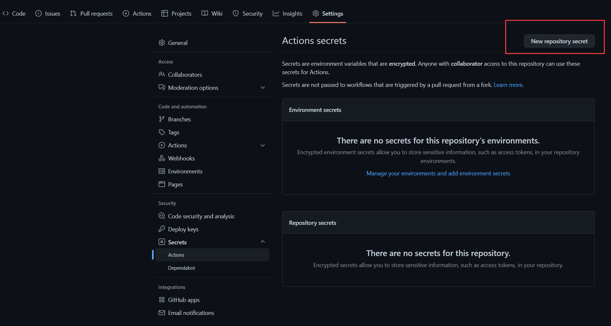
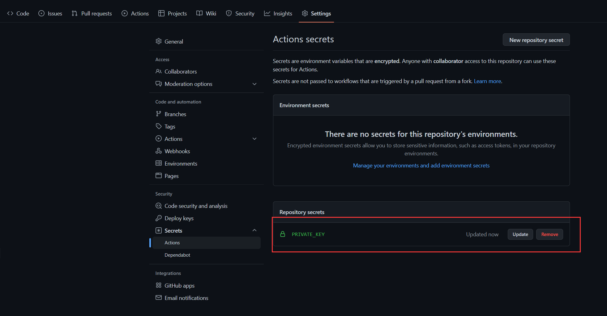
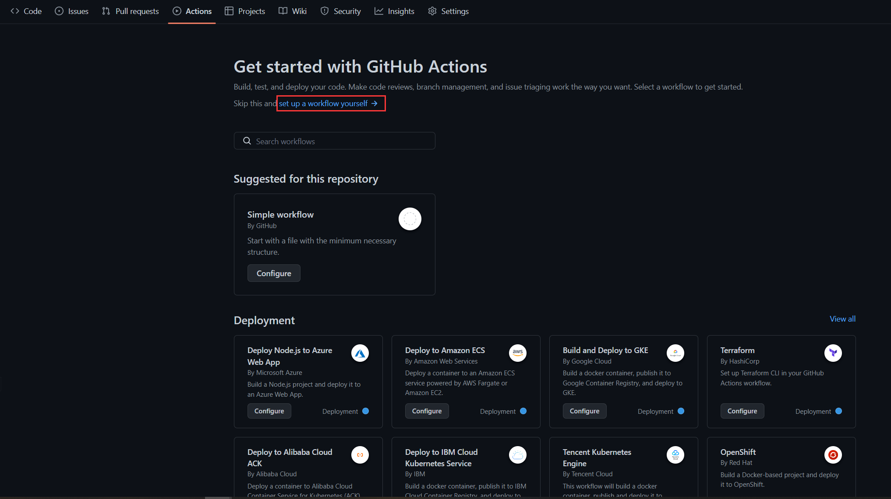
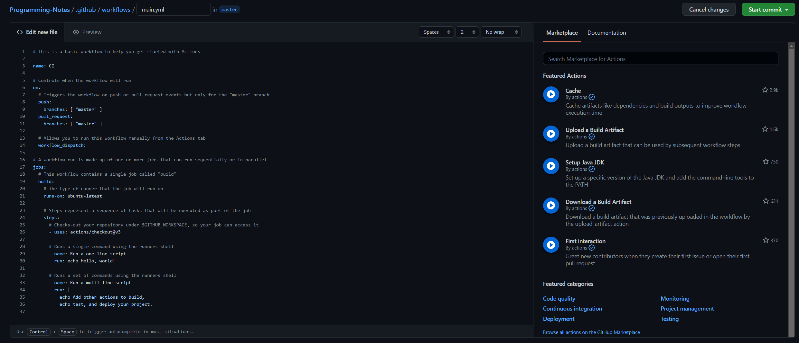
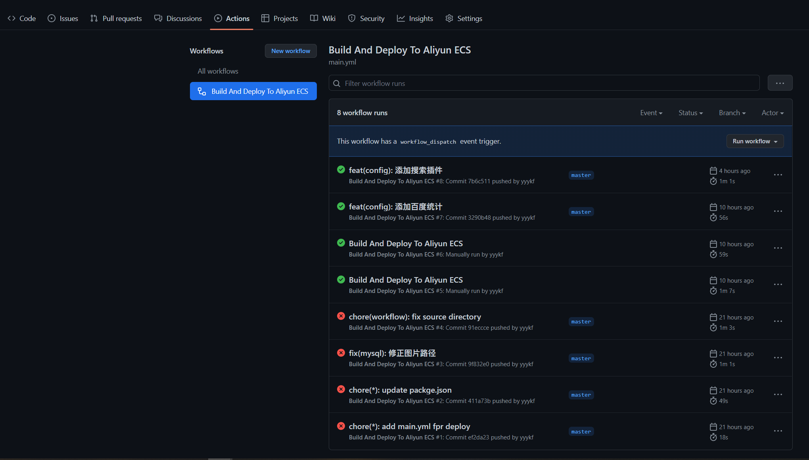

1. 首先进入GitHub仓库中的`Setting`页面，为项目添加一个环境变量，该环境变量是连接待部署的服务器的私钥，环境变量名任取。



这里我选择将环境变量命名为 `PRIVATE_KEY`，内容即为私钥。



2. 接着将公钥写入到待部署服务器的 `~/.ssh/authorized_keys`  文件中，确保可以使用对应的私钥进行连接。
3. 进入仓库的`Actions`页面，开始配置Github Actions。默认Github提供了一些模板，这里我们选择自行配置。



4. 接下来只需要编写我们用于部署的配置文件后提交即可，默认的配置文件如下所示。


根据需要修改配置文件，最终配置文件做了以下几件事：

- 拉取最新的代码
- 安装Node环境
- 安装依赖
- 编译静态页面
- 将静态页面推送至待部署的服务器

```yaml
# This is a basic workflow to help you get started with Actions

name: Build And Deploy To Aliyun ECS

# Controls when the workflow will run
on:
  # Triggers the workflow on push request events but only for the "master" branch
  push:
    branches: [ "master" ]
    # The workflow only run when push event include at least one file inside the docs directory
    paths:
      - 'docs/**'

  # Allows you to run this workflow manually from the Actions tab
  workflow_dispatch:

# A workflow run is made up of one or more jobs that can run sequentially or in parallel
jobs:
  # This workflow contains a single job called "build"
  build:
    # The type of runner that the job will run on
    runs-on: ubuntu-latest

    # Steps represent a sequence of tasks that will be executed as part of the job
    steps:
      # Checks-out your repository under $GITHUB_WORKSPACE, so your job can access it
      - name: Checkout
        uses: actions/checkout@v2

      # Setup Node.js environment
      - name: Setup Node
        uses: actions/setup-node@v1
        with:
          node-version: 16.13.0

      # Runs a set of commands using the runners shell
      - name: Install Dependencies
        run: npm install
        
      # Build static paes
      - name: Build
        run: npm run docs:build
        
      - name: Deploy To Aliyun
        uses: easingthemes/ssh-deploy@v2.2.11
        with:
          # Private Key
          SSH_PRIVATE_KEY: ${{ secrets.PRIVATE_KEY }}
          # Arguments to pass to rsync
          # ARGS: # optional, default is -rltgoDz
          # Source directory
          SOURCE: "docs/.vuepress/dist/"
          # Remote host
          REMOTE_HOST: 
          # Remote user
          REMOTE_USER: 
          # Target directory
          TARGET: 
```
这里补充一下，最后的 `SOURCE` 代表需要推送至远程服务器的文件夹，取决于 VuePress 的配置，默认情况下项目结构如下，静态页面存放在 `dist` 文件夹中，所以需要自行更改为相应的路径。
```
└─ docs
   ├─ .vuepress
   │  ├─ dist
   │  └─ config.ts
   └─ README.md
```
还有一点就是在配置文件中指定了过滤的路径，只有当推送内容包含 `docs` 文件夹时才触发自动构建，这里也需要自行决定。
具体的 GitHub Actions 用法请参考官方文档。

5. 最终的结果如下所示。



### 参考链接

- [GitHub Actions 工作流文档](https://docs.github.com/en/actions/using-workflows/workflow-syntax-for-github-actions)
- [GitHub Pages 部署](https://v2.vuepress.vuejs.org/zh/guide/deployment.html#github-pages)
