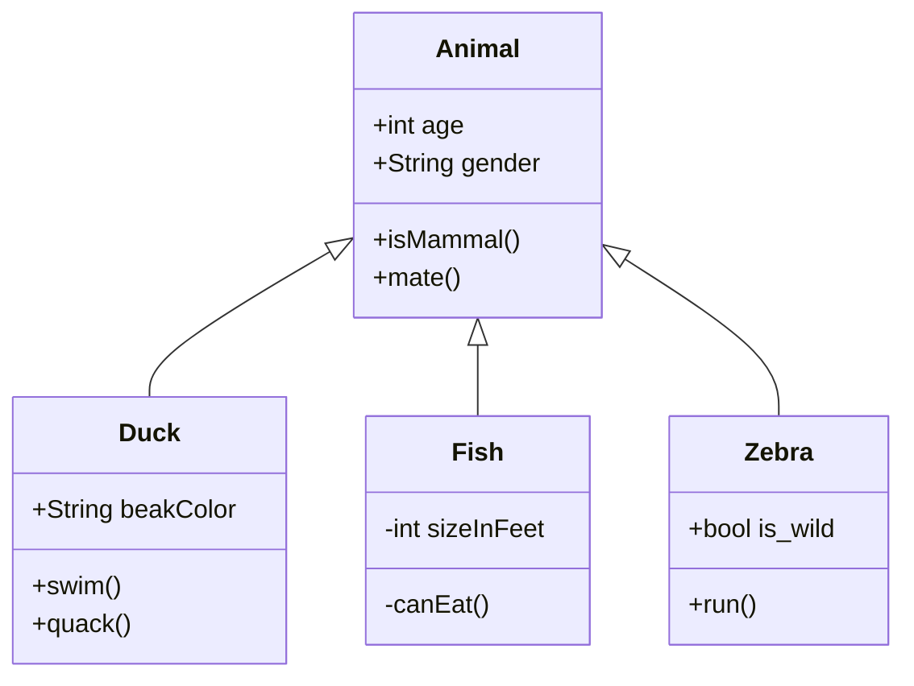
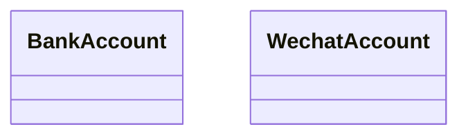
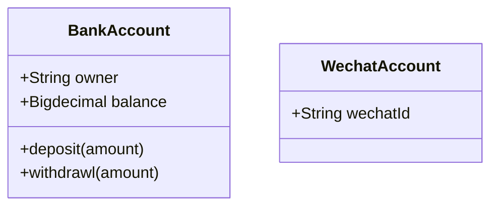
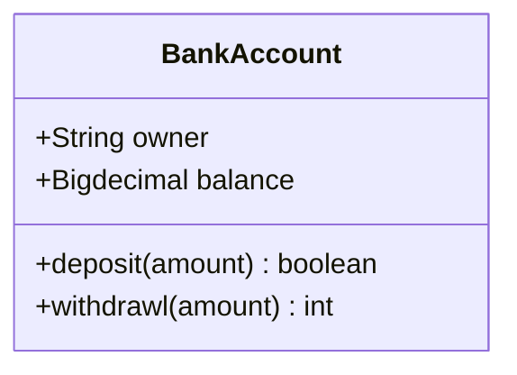
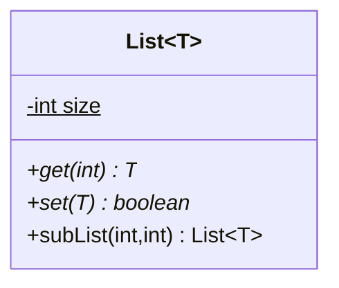
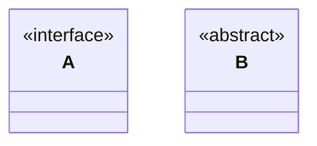
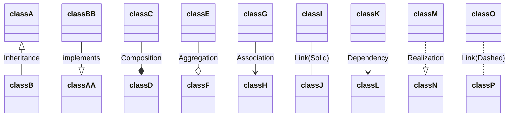

> **"In software engineering, a class diagram in the Unified Modeling Language (UML) is a type of static structure diagram that describes the structure of a system by showing the system's classes, their attributes, operations (or methods), and the relationships among objects." Wikipedia** 

先看来自官网的例子。

::: normal-demo 官网示例

```
classDiagram
      Animal <|-- Duck
      Animal <|-- Fish
      Animal <|-- Zebra
      Animal : +int age
      Animal : +String gender
      Animal: +isMammal()
      Animal: +mate()
      class Duck{
          +String beakColor
          +swim()
          +quack()
      }
      class Fish{
          -int sizeInFeet
          -canEat()
      }
      class Zebra{
          +bool is_wild
          +run()
      }
```
:::


### 语法说明
#### 类的定义

使用 `class 类名` 来声明一个类。
::: normal-demo 类的定义

```
classDiagram

    class BankAccount
    class WechatAccount
```
:::

#### 类成员的声明
对于类内部的成员，可以通过两种定义方式来声明。

1. 第一种是 `类名 : 成员`，适用与一次定义一个成员。
> Mermaid 根据成员是否含有 () 来判定是属性还是方法。

::: normal-demo 类成员声明-1

```
classDiagram

    class BankAccount
    class WechatAccount
		
    BankAccount : +String owner
    BankAccount : +Bigdecimal balance
    BankAccount : +deposit(amount)
    BankAccount : +withdrawl(amount)
		
    WechatAccount : +String wechatId
```
:::

2. 第二种是使用 `{}` 的方式来声明，比如符合平时的编码习惯。
::: normal-demo 类成员声明-2

```
classDiagram
classDiagram

    class BankAccount{
        +String owner
        +Bigdecimal balance
        +deposit(amount)
        +withdrawl(amount)
    }
		
    class WechatAccount{
        +String wechatId
    }
		
```
:::

##### 类型返回值
如果需要返回值，那么在方法签名后增加写上即可，中间用空格隔开。
::: normal-demo 类型返回值

```
classDiagram

    class BankAccount{
        +String owner
        +Bigdecimal balance
        +deposit(amount) boolean
        +withdrawl(amount) int
    }
```
:::


##### 泛型
使用 `~Type~` 进行定义。
::: normal-demo 泛型

```
classDiagram
	
	class List~T~{
		-int size$
		+get(int)* T
		+set(T)* boolean
		+subList(int,int) List~T~
	}
```
:::
- 如果是抽象方法，可以使用 `*` 标识在方法签名后
- 如果是静态方法/属性，可以使用 `$`标识在属性名后

#### 类的元数据
可以在类声明的时候，使用 `<<说明>>` 来对类进行补充说明。

- `<<interface>>` 接口
- `<<abstract>>` 抽象类
- `<<service>>` 业务接口
- `<<enumeration>>` 枚举类型
::: normal-demo 类的元数据

```
classDiagram

	class A
	<<interface>> A
	
	class B{
		<<abstract>>
	}
```
:::

#### 关系
| **Type** | **Description** |
| --- | --- |
| <&#124;-- | Inheritance |
| *-- | Composition |
| o-- | Aggregation |
| --> | Association |
| ..> | Dependency |
| ..&#124;> | Realization |

上面这些 Relations 都是由下面的 `Relation Type` 和 `Link` 组成的，可以自由搭配。

| **Type** | **Description** |
| --- | --- |
| <&#124; | Inheritance |
| * | Composition |
| o | Aggregation |
| > | Association |
| < | Association |
| &#124;> | Realization |

| **Type** | **Description** |
| --- | --- |
| -- | Solid |
| .. | Dashed |

这里需要说明箭头的方向是可以改变的，比如 `classA <|-- classB`，也可以 `classB --|> A`。
同时，我们也可以对关系进行一个描述，使用 `[classA][Arrow][ClassB]:LabelText` 的语法。

::: normal-demo 关系描述

```
classDiagram
classA <|-- classB: Inheritance
classBB --|> classAA: implements

classC --* classD : Composition
classE --o classF : Aggregation
classG --> classH : Association
classI -- classJ : Link(Solid)
classK ..> classL : Dependency
classM ..|> classN : Realization
classO .. classP : Link(Dashed)
```
:::

### 参考链接
- [官方文档](https://mermaid-js.github.io/mermaid/#/README)
