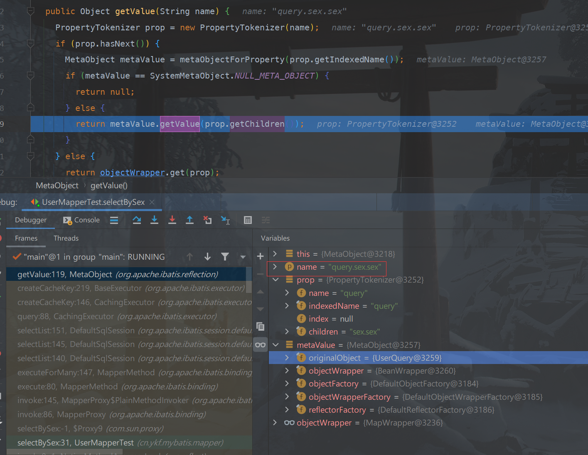
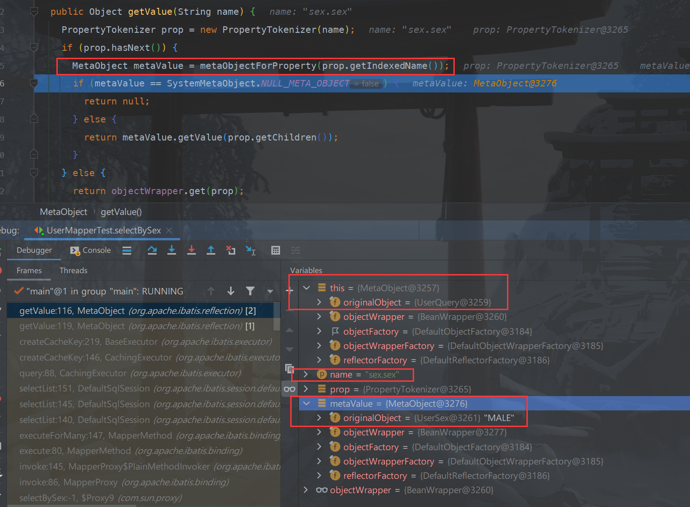
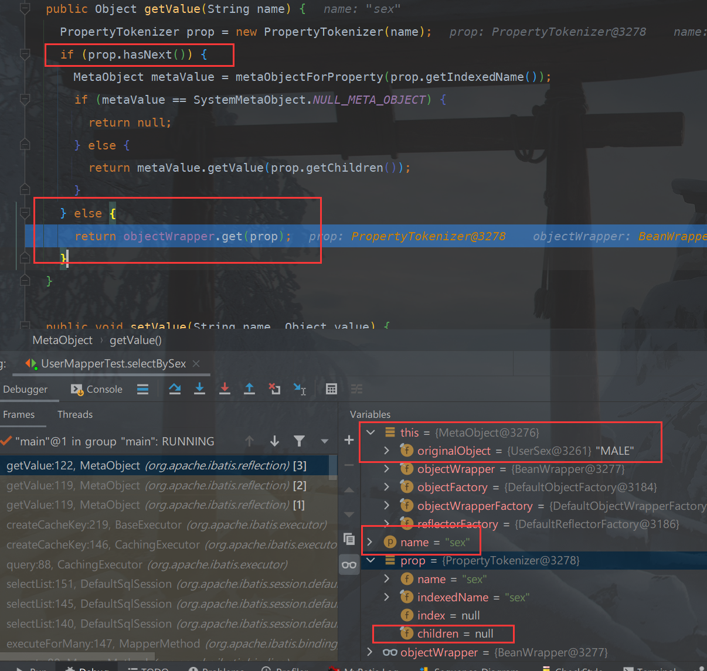

我们知道，Mybatis 的 Mapper 方法是可以直接接受对象入参的，一般来说，查询对象中我们都会直接用包装类型，例如：
```java
public interface UserMapper {

    List<User> selectBySex(@Param("query") UserQuery query);
}

public class UserQuery {

    private Integer id;
    private String sex;

    public Integer getId() {
        return id;
    }

    public void setId(Integer id) {
        this.id = id;
    }

    public String getSex() {
        return sex;
    }

    public void setSex(String sex) {
        this.sex = sex;
    }
}
```
> Mapper 参数如果不使用 `@Param` 标注的话，默认为 `param1` 。

此时的 Mapper 映射文件应该是这样写的。
```xml
<mapper namespace="cn.ykf.mybatis.mapper.UserMapper">
  
    <select id="selectBySex" resultType="cn.ykf.mybatis.model.User">
        SELECT *
        FROM user
        <where>
            <if test="query.id != null">
                AND id = #{query.id}
            </if>
            <if test="query.sex != null and query.sex != ''">
                AND sex = #{query.sex}
            </if>
        </where>
    </select>
```
但是有时候我们想进一步限制查询条件的范围，那么我们就可以将性别抽取成一个枚举类，然后将该枚举类作为查询参数，改造如下。
```java
public enum UserSex {
    MALE("男"),
    FEMALE("女");

    private final String sex;

    UserSex(String sex) {
        this.sex = sex;
    }

    public String getSex() {
        return sex;
    }
}

public class UserQuery {

    private Integer id;
    /** 使用枚举限定查询参数范围 */
    private UserSex sex;

    public Integer getId() {
        return id;
    }

    public void setId(Integer id) {
        this.id = id;
    }

    public UserSex getSex() {
        return sex;
    }

    public void setSex(UserSex sex) {
        this.sex = sex;
    }
}
```
此时的 Mapper 映射文件应该改造成下面这样。
```xml
<mapper namespace="cn.ykf.mybatis.mapper.UserMapper">

  <select id="selectBySex" resultType="cn.ykf.mybatis.model.User">
        SELECT *
        FROM user
        <where>
            <if test="query.id != null">
                AND id = #{query.id}
            </if>
            <if test="query.sex != null">
                AND sex = #{query.sex.sex}
            </if>
        </where>
    </select>
</mapper>
```
注意到此时的查询参数写法变成了 `#{query.sex.sex}`，这表示会使用 `query` 对象的 `sex` 属性中的 `sex` 属性，最终就会通过枚举的 `getSex()` 方法获取到最终的参数值。
因此，查询条件使用枚举作为入参是原生 Mybatis 就支持的，查看源码的调用链路如下。



一步步跟下去，可以发现 Mybatis 最终会通过 `org.apache.ibatis.reflection.wrapper.BeanWrapper#getBeanProperty` 方法，根据当前属性名，到当前的查询对象中获取其 `getter` 方法并调用。

- 当参数为 `query.sex.sex` 时，此时的子参数为 `sex.sex`，当前对象为 `UserQuery`，那么通过 `UserQuery#getSex` 得到 `UserSex` 对象。

- 继续遍历， 当参数变为 `sex.sex` 时，此时的子参数为 `sex`，当前对象为 `UserSex`，那么通过 `UserSex#getSex` 得到 `String` 对象，其值就是最终需要的参数值。




## TypeHandler
至于为什么在这里不需要使用 `TypeHandler`，首先我们要明确一件事，`TypeHandler` 是来帮助我们自动进行转换的，例如，实体类中含有枚举类型的成员，而该成员对应数据库中的某个类型。

那么当我们要进行插入数据的入库，或者查询数据的出库，由于我们只需要传入实体类或者接受实体类，那么就需要有一个机制来自动帮助我们将枚举类型转换为数据库中对应的类型，或者将数据库中对应的类型转换为枚举类型，这个机制就是 `TypeHandler`。

```java
public interface TypeHandler<T> {

  /**  将类型为 T 的参数转换为对应的数据库类型，用于入库 */
  void setParameter(PreparedStatement ps, int i, T parameter, JdbcType jdbcType) throws SQLException;

  /** 以下三个方法都用于将数据库记录的某一列数据转换为对应的 T 类型，用于出库 */
  T getResult(ResultSet rs, String columnName) throws SQLException;

  T getResult(ResultSet rs, int columnIndex) throws SQLException;

  T getResult(CallableStatement cs, int columnIndex) throws SQLException;

}
```
可以发现，由于查询的时候，我们已经显示指定了要使用 `UserSex` 枚举的 `sex` 属性，所以此时 Mybatis 并不需要用到 `TypeHandler` 来做类型的转换，只需要简单找到对应的 `Getter` 方法并调用即可，而由于入库和出库都是 Mybatis 自动帮我们进行的，所以我们才需要显式指定 `TypeHandler` 来告诉 Mybatis 怎么对某个列的类型进行转换。

That's all. 至于 Mybatis 中是在哪一处才调用了 `TypeHandler`，有机会再 Debug 瞅一眼。
