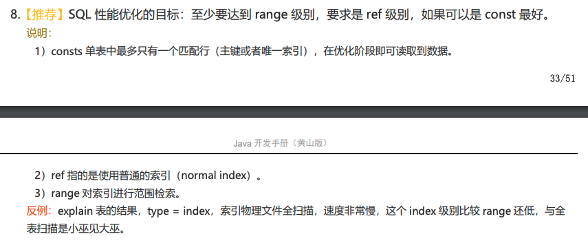

| id | select_type | table | partitions | type | possible_keys | key | key_len | ref | rows | filtered | Extra |
| --- | --- | --- | --- | --- | --- | --- | --- | --- | --- | --- | --- |
| 1 | PRIMARY | pti |  | ALL |  |  |  |  | 16170 | 100.0 | Using where |
| 2 | DEPENDENT SUBQUERY | p |  | eq_ref | PRIMARY | PRIMARY | 56 | product_transfer.ti.product_id | 1 | 10.0 | Using where |

- rows
   - 表示 MySQL 认为执行查询必须需要检查的行数。
   - 当表使用的是 `InnoDB` 引擎时，该数值只是一个估计值，不是绝对准确的。
- filtered
   - 表示根据条件过滤后的行数所占的表的百分比。
   - 最大值为 100，代表没有过滤任何数据。`rows * filtered` 表示会参与到与下张表的连接中。以上表为例，代表所有的行数都会参与到与下一张表的连接中，
- type
   - 表示表的连接方式。
   - `system`
      - 代表表只有一行记录，一般是系统表，启动时就被加载到内存中了，查询的时候不需要进行磁盘I/O，这是 `const` 连接类型的特例。
   - `const`
      - 表示和常量进行连接，该种方式最多只有一行符合记录，只需要一次查询即可，例如命中主键索引或者唯一索引。
   - `eq_ref`
      - 前表中的每一行，后表只有一行记录会被扫描出来。
      - 常见场景有 `join` 连接使用了后表索引的所有部分，或者命中了后表的主键索引或者唯一非空索引。
   - `ref`
      - 前表中的每一行，后表会有多行记录会被扫描出来，也就是会有多行记录命中了索引值。
      - 和 `eq_ref` 的区别就是命中了普通非唯一索引。
   - `index_merge`
      - 索引合并。
   - `range`
      - 范围查询，例如 `>=` `<=` `BETWEEN...AND` `IN` `LIKE` `IS NULL`等操作符。
   - `index`
      - 类似于 `ALL`，区别只是扫描了索引树。
      - 常见的场景有索引覆盖，此时只需要扫描索引树就可以拿到需要的数据了，此时的 `Extra` 列会显示 `Using index`。或者按索引顺序执行了全表扫描，此时的 `Extra` 列不会显示 `Using index`。
      - 当连表时用到了索引的部分列时，就有可能使用这种连接类型。
   - `ALL`
      - 直接全表扫描，比如两张表进行连接后，如果无法使用索引，那么就只能直接扫描该连接表了，效率最低。
#### 附录

- 阿里规约推荐SQL优化最少要达到 range 级别。
   - 
#### 参考链接

- [8.8.2 EXPLAIN Output Format](https://dev.mysql.com/doc/refman/5.7/en/explain-output.html#explain_rows)
