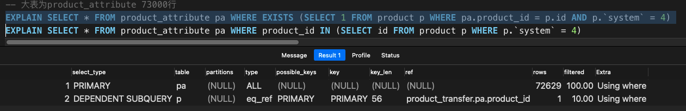
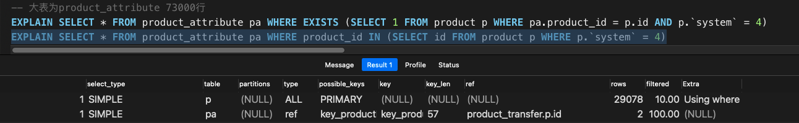

- 需求
   - 查询某个系统的商品的所有标签信息。
- 数据量
   - 标签信息 `product_tag_info` 为小表（16,077 行）。
   - 商品 `product` 为大表（30,039 行）。

#### EXISTS 子查询
```sql
SELECT
	* 
FROM
	product_tag_info pti 
WHERE
	EXISTS ( SELECT 1 FROM product p WHERE pti.product_id = p.id AND p.`system` = 4 )
```
该查询会先遍历外表 `product_tag_info`，对于每一条记录，都会放入子查询中进行验证，如果子查询的结果为 `TRUE`（也就是子查询只要有结果），那就说明该记录满足查询，将其放入结果表。

因为外表是一定会遍历的，而内表的子查询可以使用索引，所以外表适合使用小表，而内表则使用大表。

使用 `EXPLAIN` 查看一下执行计划。

| **id** | **select_type** | **table** | **partitions** | **type** | **possible_keys** | **key** | **key_len** | **ref** | **rows** | **filtered** | **Extra** |
| --- | --- | --- | --- | --- | --- | --- | --- | --- | --- | --- | --- |
| 1 | PRIMARY | pti |  | ALL |  |  |  |  | 16170 | 100.0 | Using where |
| 2 | DEPENDENT SUBQUERY | p |  | eq_ref | PRIMARY | PRIMARY | 56 | product_transfer.pti.product_id | 1 | 10.0 | Using where |

从首行的 `type = ALL`可以看到，对于外表 `product_tag_info` 确实是使用了全表扫描，而从第二行的 `type=eq_ref` 和 `key=PRIMARY` 可以看出依赖子查询是直接走了内表 `product` 的主键索引。

最终执行结果如下。


#### IN 子查询 
```sql
SELECT
	*
FROM
	product_tag_info pti
WHERE
	product_id IN (
	SELECT
		id
	FROM
		product p
	WHERE
		p.`system` = 4)
```
该查询会先执行子查询，拿到所有符合条件的商品ID，然后再执行外部查询，等价于 `SELECT * FROM product_tag_info WHERE product_id = xxx OR product_id = xxx`。

> Question
> 
> 根据网上大部分说法，都是说 IN 适用于外表为大小，内表为小表的情况。其实这个说法不太能理解，因为子查询也是可以使用索引的，这里子查询直接走了全表是因为 `system` 列上没有索引，如果有的话也是可以走的。
> 
> 难道是因为怕子查询不走索引，所以建议内表使用小表避免全表扫描的效率太低？

使用 `EXPLAIN` 查看一下执行计划。

| **id** | **select_type** | **table** | **partitions** | **type** | **possible_keys** | **key** | **key_len** | **ref** | **rows** | **filtered** | **Extra** |
| --- | --- | --- | --- | --- | --- | --- | --- | --- | --- | --- | --- |
| 1 | SIMPLE | p |  | ALL | PRIMARY |  |  |  | 29078 | 10.0 | Using where |
| 1 | SIMPLE | pti |  | ref | un_TagProduct | un_TagProduct | 57 | product_transfer.p.id | 1 | 100.0 |  |

可以看到首先执行的是子查询，也就是对 `product` 进行了全表扫描，然后再使用子查询的结果对外表进行扫描，外表扫描使用了 `un_TagProduct` 索引，也就是用到了该唯一索引的第一列 `product_id`。

>   KEY `key_TagName` (`tag_name`) USING BTREE COMMENT '商品标签名称索引'

最终执行结果如下。


#### 结论

对比两种查询的执行结果，其实在该数据量下差距不大，所以想用哪种都可以吧，不过要注意的是 `EXISTS` 子查询一定要使用大表作为内表，避免外层循环次数过多。

#### 补充

- 另外一个数据差距比较大的查询，此时明显使用 `IN` 更加的合适。
   - 
   - 
- 关于两个查询的执行计划中的  `type` 为什么不同参考下面链接👇。
   - [关于 EXPLIAN 的行解释](https://www.yuque.com/alipaybi5i7vymhl/rly20s/quiom8?view=doc_embed)
