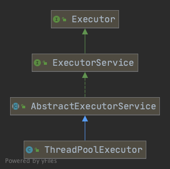
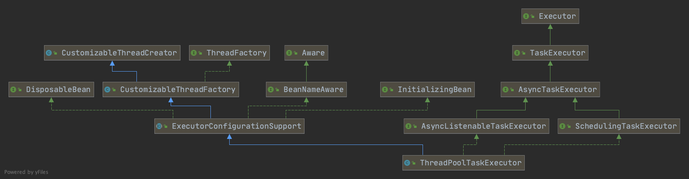

在业务开发中，我们经常会使用到线程池，而可能最常见要属 `ThreadPoolExecutor` 和 `ThreadPoolTaskExecutor`。

虽然这两者的类名很相似，但是它们分别来自于不同的库。对于前者 `ThreadPoolExecutor`，它归属于 JUC(java.util.concurrent) 包，是 JDK 自带的线程池，其类图如下所示。



可以看到该类其实就是 `ExecutorSerivce` 的一个实现类，相关的API及参数在这里不赘述。

再来看一下后者 `ThreadPoolTaskExecutor`，它是 Spring 中的线程池，它的继承关系会比前者更加复杂，因为它的生命周期是可以由 Spring 来管理的，所以会多出一些 Spring 相关的高级特性。



可以看到，该类的继承关系中多出了 `InitializingBean`、`DisposableBean`等和声明周期有关的接口。同时，`ThreadPoolTaskExecutor` 虽然最终也实现了 `Executor`，但是它是实现其子类 `TaskExecutor`。

这里的 `TaskExecutor` 接口其实和 `Executor` 是完全一样的，Spring 设计这个类的原因只是为了向后（下）兼容 JDK 1.4，因为 `Executor` 接口是 JDK 1.5 才出现的，所以为了低版本的 JDK 也能用上线程池的功能，Spring 就设计了这个类并且在该类进行线程池实现的扩展。

```java
/**
 * Simple task executor interface that abstracts the execution
 * of a {@link Runnable}.
 *
 * <p>Implementations can use all sorts of different execution strategies,
 * such as: synchronous, asynchronous, using a thread pool, and more.
 *
 * <p>Equivalent to JDK 1.5's {@link java.util.concurrent.Executor}
 * interface; extending it now in Spring 3.0, so that clients may declare
 * a dependency on an Executor and receive any TaskExecutor implementation.
 * This interface remains separate from the standard Executor interface
 * mainly for backwards compatibility with JDK 1.4 in Spring 2.x.
 *
 * @author Juergen Hoeller
 * @since 2.0
 * @see java.util.concurrent.Executor
 */
@FunctionalInterface
public interface TaskExecutor extends Executor {

	/**
	 * Execute the given {@code task}.
	 * <p>The call might return immediately if the implementation uses
	 * an asynchronous execution strategy, or might block in the case
	 * of synchronous execution.
	 * @param task the {@code Runnable} to execute (never {@code null})
	 * @throws TaskRejectedException if the given task was not accepted
	 */
	@Override
	void execute(Runnable task);

}
```
Spring 2.5 版本关于该类的定义是没有继承 `Executor`，这点从上面的 JavaDoc 也可以看出来。
```java
package org.springframework.core.task;

/**
 * ....
 *
 * <p>Equivalent to JDK 1.5's {@link java.util.concurrent.Executor}
 * interface. Separate mainly for compatibility with JDK 1.4.
 * Implementations can simply implement the JDK 1.5 <code>Executor</code>
 * interface as well, as it defines the exact same method signature.
 */
public interface TaskExecutor {
    // ...
}
```
对于低版本的 JDK，其 Spring 线程池实现了 `TaskExecutor`，因此在高版本的 JDK 中，可以直接使用 `Executor` 引用来接收，完全兼容。

继续往下走，`AsyncTaskExecutor`继承了 `TaskExecutor`，这是一个异步的线程池接口，同时支持提交 `Callable` 任务。

> `AsyncTaskExecutor` 还重载了 `execute()` 方法，增加了一个 `startTimeout` 的参数，根据 JavaDoc 来看，该参数指示线程池需要在指定时间内执行该任务，但是允许首先执行即时任务（即参数为0）。

> 查看 Spring 提供的所有默认子类发现，只有`SimpleAsyncTaskExecutor` 类用到了该参数，但是并没有严格使用该参数，只是说在参数不为0的时候对并发线程数做了一下限制，具体细节可以查看 `org.springframework.core.task.SimpleAsyncTaskExecutor#execute(java.lang.Runnable, long)`。

```java
/**
 * Extended interface for asynchronous {@link TaskExecutor} implementations,
 * offering an overloaded {@link #execute(Runnable, long)} variant with a start
 * timeout parameter as well support for {@link java.util.concurrent.Callable}.
 *
 * <p>Note: The {@link java.util.concurrent.Executors} class includes a set of
 * methods that can convert some other common closure-like objects, for example,
 * {@link java.security.PrivilegedAction} to {@link Callable} before executing them.
 *
 * <p>Implementing this interface also indicates that the {@link #execute(Runnable)}
 * method will not execute its Runnable in the caller's thread but rather
 * asynchronously in some other thread.
 *
 * @author Juergen Hoeller
 * @since 2.0.3
 * @see SimpleAsyncTaskExecutor
 * @see org.springframework.scheduling.SchedulingTaskExecutor
 * @see java.util.concurrent.Callable
 * @see java.util.concurrent.Executors
 */
public interface AsyncTaskExecutor extends TaskExecutor {

	/** Constant that indicates immediate execution. */
	long TIMEOUT_IMMEDIATE = 0;

	/** Constant that indicates no time limit. */
	long TIMEOUT_INDEFINITE = Long.MAX_VALUE;


	/**
	 * Execute the given {@code task}.
	 * @param task the {@code Runnable} to execute (never {@code null})
	 * @param startTimeout the time duration (milliseconds) within which the task is
	 * supposed to start. This is intended as a hint to the executor, allowing for
	 * preferred handling of immediate tasks. Typical values are {@link #TIMEOUT_IMMEDIATE}
	 * or {@link #TIMEOUT_INDEFINITE} (the default as used by {@link #execute(Runnable)}).
	 * @throws TaskTimeoutException in case of the task being rejected because
	 * of the timeout (i.e. it cannot be started in time)
	 * @throws TaskRejectedException if the given task was not accepted
	 */
	void execute(Runnable task, long startTimeout);

	/**
	 * Submit a Runnable task for execution, receiving a Future representing that task.
	 * The Future will return a {@code null} result upon completion.
	 * @param task the {@code Runnable} to execute (never {@code null})
	 * @return a Future representing pending completion of the task
	 * @throws TaskRejectedException if the given task was not accepted
	 * @since 3.0
	 */
	Future<?> submit(Runnable task);

	/**
	 * Submit a Callable task for execution, receiving a Future representing that task.
	 * The Future will return the Callable's result upon completion.
	 * @param task the {@code Callable} to execute (never {@code null})
	 * @return a Future representing pending completion of the task
	 * @throws TaskRejectedException if the given task was not accepted
	 * @since 3.0
	 */
	<T> Future<T> submit(Callable<T> task);

}
```
继续往下，到了 `AsyncListenableTaskExecutor`，该线程池支持任务回调，当提交了一个 `Runnable` 或 `Callable` 任务时，该线程池返回一个 `ListenableFuture`，这是一个继承自 `Future` 的类，和 Guava 的 `ListenableFuture` 用法一样，都是类似于 JUC 中的 `CompletableFuture`。可以对 `ListenableFuture` 添加成功回调和失败回调。
```java
/**
 * Extension of the {@link AsyncTaskExecutor} interface, adding the capability to submit
 * tasks for {@link ListenableFuture ListenableFutures}.
 *
 * @author Arjen Poutsma
 * @since 4.0
 * @see ListenableFuture
 */
public interface AsyncListenableTaskExecutor extends AsyncTaskExecutor {

	/**
	 * Submit a {@code Runnable} task for execution, receiving a {@code ListenableFuture}
	 * representing that task. The Future will return a {@code null} result upon completion.
	 * @param task the {@code Runnable} to execute (never {@code null})
	 * @return a {@code ListenableFuture} representing pending completion of the task
	 * @throws TaskRejectedException if the given task was not accepted
	 */
	ListenableFuture<?> submitListenable(Runnable task);

	/**
	 * Submit a {@code Callable} task for execution, receiving a {@code ListenableFuture}
	 * representing that task. The Future will return the Callable's result upon
	 * completion.
	 * @param task the {@code Callable} to execute (never {@code null})
	 * @return a {@code ListenableFuture} representing pending completion of the task
	 * @throws TaskRejectedException if the given task was not accepted
	 */
	<T> ListenableFuture<T> submitListenable(Callable<T> task);

}
```
铺垫了这么多，最后才是 `ThreadPoolTaskExecutor`，直接看类中的主要成员。其实从源码中可以看到， **`ThreadPoolTaskExecutor` 就是对 `ThreadPoolExecutor` 进行了增强，最终的所有任务执行还是交由底层的 `ThreadPoolExecutor` 去执行的。**

默认情况下，`ThreadPoolTaskExecutor` 只有一个核心线程以及近似无穷大的任务队列，相当于 `Executors.newSigleThreadExecutor`。而如果将队列长度指定为 0，那么其表现就类似于 `Executors.newCachedThreadPool`，因为在创建底层的线程池时也是使用同步队列 `SynchronousQueue` 来作为任务队列。

还有一点需要注意的是，`ThreadPoolTaskExecutor` 实现了 Spring 自己的 `TaskExecutor` 接口以及 JDK 自带的 `Executor` 接口，这里是以前者为主要接口的，因此该线程池相关的提交任务方法，如 `execute()`、`submit()` 在任务队列满了的情况会将底层抛出来的 `RejectedExecutionException` 包装为 `TaskRejectedException` 后再抛出。
```java
public class ThreadPoolTaskExecutor extends ExecutorConfigurationSupport
		implements AsyncListenableTaskExecutor, SchedulingTaskExecutor {

	private final Object poolSizeMonitor = new Object();

    /** 核心线程数 */
	private int corePoolSize = 1;
    /** 最大线程数 */
	private int maxPoolSize = Integer.MAX_VALUE;
    /** 非核心线程空闲时间，单位秒 */
	private int keepAliveSeconds = 60;
    /** 队列长度 */
	private int queueCapacity = Integer.MAX_VALUE;
    /** 默认核心线程不超时 */
	private boolean allowCoreThreadTimeOut = false;

	@Nullable
	private TaskDecorator taskDecorator;

	@Nullable
	private ThreadPoolExecutor threadPoolExecutor;
	
    /**
	 * Note: This method exposes an {@link ExecutorService} to its base class
	 * but stores the actual {@link ThreadPoolExecutor} handle internally.
	 * Do not override this method for replacing the executor, rather just for
	 * decorating its {@code ExecutorService} handle or storing custom state.
	 */
	@Override
	protected ExecutorService initializeExecutor(
			ThreadFactory threadFactory, RejectedExecutionHandler rejectedExecutionHandler) {

		BlockingQueue<Runnable> queue = createQueue(this.queueCapacity);

		ThreadPoolExecutor executor;
		if (this.taskDecorator != null) {
			executor = new ThreadPoolExecutor(
					this.corePoolSize, this.maxPoolSize, this.keepAliveSeconds, TimeUnit.SECONDS,
					queue, threadFactory, rejectedExecutionHandler) {
				@Override
				public void execute(Runnable command) {
					Runnable decorated = taskDecorator.decorate(command);
					if (decorated != command) {
						decoratedTaskMap.put(decorated, command);
					}
					super.execute(decorated);
				}
			};
		}
		else {
			executor = new ThreadPoolExecutor(
					this.corePoolSize, this.maxPoolSize, this.keepAliveSeconds, TimeUnit.SECONDS,
					queue, threadFactory, rejectedExecutionHandler);

		}

		if (this.allowCoreThreadTimeOut) {
			executor.allowCoreThreadTimeOut(true);
		}

		this.threadPoolExecutor = executor;
		return executor;
	}

	/**
	 * Create the BlockingQueue to use for the ThreadPoolExecutor.
	 * <p>A LinkedBlockingQueue instance will be created for a positive
	 * capacity value; a SynchronousQueue else.
	 * @param queueCapacity the specified queue capacity
	 * @return the BlockingQueue instance
	 * @see java.util.concurrent.LinkedBlockingQueue
	 * @see java.util.concurrent.SynchronousQueue
	 */
	protected BlockingQueue<Runnable> createQueue(int queueCapacity) {
		if (queueCapacity > 0) {
        	// 队列长度大于0时使用 LinkedBlockingQueue，否则使用同步队列
			return new LinkedBlockingQueue<>(queueCapacity);
		}
		else {
			return new SynchronousQueue<>();
		}
	}
    
	@Override
	public void execute(Runnable task) {
		Executor executor = getThreadPoolExecutor();
		try {
			executor.execute(task);
		}
		catch (RejectedExecutionException ex) {
			throw new TaskRejectedException("Executor [" + executor + "] did not accept task: " + task, ex);
		}
	}
    
	@Override
	public <T> Future<T> submit(Callable<T> task) {
		ExecutorService executor = getThreadPoolExecutor();
		try {
			return executor.submit(task);
		}
		catch (RejectedExecutionException ex) {
			throw new TaskRejectedException("Executor [" + executor + "] did not accept task: " + task, ex);
		}
	}
}
```
总结一下，`ThreadPoolExecutor` 是 JDK 自带的线程池，是最常用的线程池，而 `ThreadPoolTaskExecutor` 是 Spring 的线程池，底层也是使用的 `ThreadPoolExecutor`，只不过对其进行了增强，并且增加了 Bean 生命周期等相关功能。
